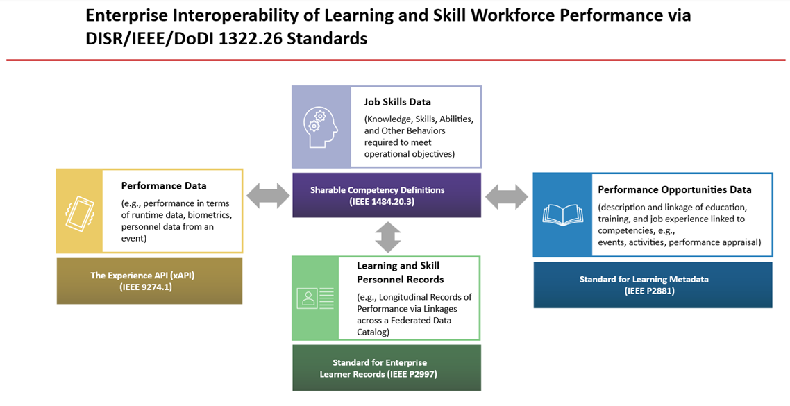
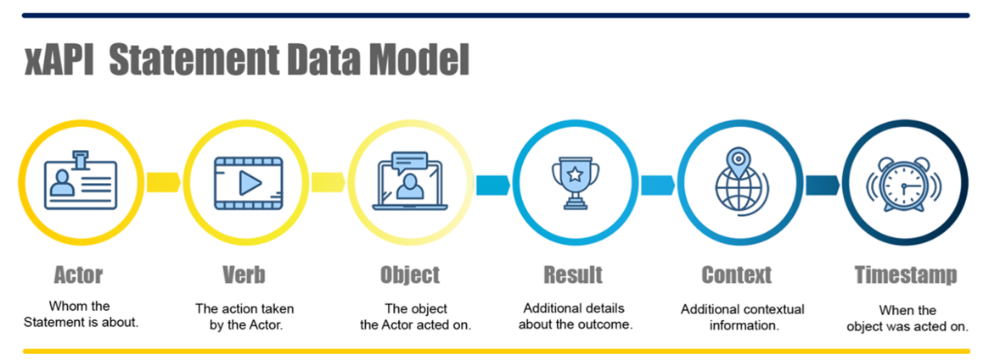

*The ADL Initiative has been formally sunset. While the program has ended, its repositories have been archived and remain available for continued public use. Additional context and resources are available here: <https://adlnet.github.io/>*

**DoDI 1322.26 Digital Learning (DL) Implementation Reference: DoW Data Strategy using Learning Data Standards to standardize data for education, training and workforce skills**

The [Department of Defense Instruction (DoDI) 1322.26](https://www.esd.whs.mil/Portals/54/Documents/DD/issuances/dodi/132226_dodi_2017.pdf?ver=2017-10-05-073235-400/home_new) ("Distributed Learning") establishes policy and requirements for a data strategy that enables the definition, collection, and sharing of data related to the education, training, and skills needed to effectively perform a job in the DoW. This document is the accompaniment that defines the technical requirements to enable interoperability across connected defense systems, networks, and organizations using consistent Information Technology (IT) protocols able to be universally adopted to share and interpret learner data.

These technical specifications were derived from requirements captured across DoW and are governed by Standards Development Organizations (SDOs) such as the Institute for Electrical and Electronic Engineers (IEEE).

To make decisions about whether the workforce has the right skills to perform their jobs, agencies in the DoW require data strategies and the data discussed in this document.

**Applicability**

The data standards defined within DoDI 1322.26 and these References are considered mandatory requirements in in the [DoD Information Technology Standards Registry (DISR); DoW components must comply or request an exemption.](https://www.dsp.dla.mil/Specs-Standards/List-of-DISR-documents/) The DISR provides "building codes" to ensure interoperability and net-centricity across all DoW systems. The requirements in the DoDI 1322.26 and this document applies to any DoW IT network, information system, software, and service supporting any type of training, education, professional development, or career-field management functions within DoW Components (e.g., accredited DoW academic institutions).

**Requirement:** DoW Components SHALL Implement Total Learning Architecture (TLA) Enterprise Learning Data Standards found in this document and SHOULD use guidance found in this document to gain compliance, reduce costs, and improve DoW data interoperability.

Table of Contents

[Section 1: Overview of Required Standards.............................................](#Section1)

[Job Skills Data Standard (SCD).............................................](#Section1SCD1)

[Learning Metadata Terms (LMT)..............................................](#Section1LMT2)

[xAPI / xAPI Profiles / cmi5................................................](#Section1xAPI3)

[Enterprise Learner Record (ELR)............................................](#Section1ELR4)

[Section 2: Acquisition Language and Requirements......................................](#Section2)

[Integrating the Four TLA Standards.........................................](#Section2Integrating)

[SCD Requirements...........................................................](#Section2SCD1)

[LMT Requirements...........................................................](#Section2LMT2)

[xAPI Standards' Requirements....................................................](#Section2xAPI3)

[ELR Requirements...........................................................](#Section2ELR4)

[Section 3: Use Cases...................................................................](#Section3)

[Individual Development Plan................................................](#Section3IDP1)

[Certification and Credential Management....................................](#Section3CertCred2)

[Section 4: Enterprise Digital Learning Modernization..................................](#Section4)

[Section 5: Reference Implementations / Code...........................................](#Section5)

[Appendix A: Implementation Strategies......................................](#AppendixB)

[Appendix B: Actor-driven Requirements / RTVMs / User Stories................](#AppendixC)

**External Links:**

- **[Github.IO](https://adlnet.github.io/)**
  - Site that showcases all of the former ADL-Initiative projects and their respective Github sites
- [**Published xAPI Profiles**](https://github.com/adlnet/xapi-authored-profiles)
  - All known and published profiles of xAPI, many taken from the original ADL Profile Server. Continuously updated even after the defunding of ADL.
- [**Enterprise Course Catalog**](https://adlnet.github.io/#ecc)
  - Link to the Github site for the Enterprise Course Catalog project
- [**Linked Data and Schema Service**](https://adlnet.github.io/#ldss)
  - Link to the Github site for the Linked Data and Schema Service project
- [**Enterprise Learner Record Repository**](https://adlnet.github.io/#elrr)
  - Link to the Github site for the Enterprise Learner Record Repository project
- [**Cmi5 Testing (CATAPULT)**](https://adlnet.github.io/#catapult)
  - Link to the Github site for the cmi5 Test Suite, also known as CATAPULT.

**Section 1: Overview of Required Standards**

There are four Total Learning Architecture (TLA) standards that align learning to job skill performance. The IEEE 1484.20.3 is required to define and store the skills needed to perform jobs. The IEEE 2881 is required to link learning, training and job experiences to those skills. IEEE 9274.1 collects learner activity to assess if the skill is demonstrated during training. Finally, the fourth \[and the only optional standard (IEEE 2997)\] collects this information about the workforce and stores it in enterprise-wide learner records, so that skill data is collected and compiled across each learner's career.

Figure 1: TLA Standards

Compliance with the standards above lays a foundation for a powerful, DoW - wide enterprise system that can efficiently translate and equate what a person has done in their career to what is needed to perform a job.

**Standard #1: Job Skills Data Standard**

\-describes and formats the knowledge and skills data required for DoW jobs

\-aka IEEE 1484.20.3 Competency Data Standards: Sharable Competency Definitions (SCD)  
 **Purpose:** In order to describe job skills data in across agencies, a data level component was created to represent a skill, knowledge, ability, attitude, task, or even a job. A DoW "job competency" can consist of all of the knowledge, skills, etc. required to successfully execute a job.

**Requirement:** DoW Components SHALL implement the SCD standard (IEEE 1484.20.3) by following all requirements (denoted by SHALL) in the standard and in this document.

**Description of Standard:** This standard formally describes the key characteristics of a competency, the relationship to other competencies within a competency framework, and assessment criteria for demonstrating proficiency (e.g., Outcome-Based).

**Standard #2: Experience Data Standard**

\-describes and formats how learning experiences, training, and performance assessments link to knowledge and skills required for DoW jobs

\-aka IEEE 2881 Learning Metadata Terms (LMT)

**Purpose:** Learning and Training Events, such as courses, exercises, assessments, LVC activities and mission rehearsals are opportunities to teach or assess skills that are required for a job. Metadata is used to describe these learning resources, which can be used to increase visibility and accessibility of reusable resources.  
 **Requirement:** DoW Components SHALL implement the LMT standard (IEEE 2881) by following all requirements (denoted by SHALL) in the standard, the entire data model of the standard, and requirements, such as profiles, that are defined in this document. All DoD digital resources and temporal creations of them SHALL be considered Learning Resources or Learning Events (capitalization to indicate class-like relationships).

**Description of Standard:** LMT defines a set of terms for describing digital objects related to learning, education, training, and professional development. LMT integrates with existing metadata standards in a way that provides the basis for use cases across communities of practice, standards, and extensibility through the creation of application profiles while remaining flexible in data design.

**Standard #3: Learning and Skill performance**

Aka IEEE 9274.1.1 "Experience API/xAPI", IEEE 9274.2.1 "xAPI Profiles", IEEE 9274.3.1 "cmi5".

**Purpose:** During learning and training events a learner will perform different actions that can be monitored and used to report out on their performance. The xAPI set of standards make tracking that data interoperable, across various systems. xAPI Profiles/IEEE 9274.2.1 is a way of creating specific performance profiles for key data.

**Requirement:** DoD Components SHALL implement the xAPI (IEEE 9274.1.1), xAPI Profiles (IEEE 9274.2.1), and cmi5 (IEEE 9274.3.1) standards by following all requirements (denoted by SHALL) in the standard, including specific xAPI profiles, that are defined in this document.

**Description of Standard:** The xAPI [standard](https://opensource.ieee.org/xapi/xapi-base-standard-documentation/-/blob/main/9274.1.1%20xAPI%20Base%20Standard%20Overview.md) lays the foundation for the interoperable exchange of learning experience data for different types of learning activities. xAPI is both a learning technology standard and a web-service specification requiring a web-services application programming interface (API) for describing, recording, and sharing individual or team performance across digital learning systems. The xAPI Profile Standard is a collection of xAPI Statement templates and patterns guiding the implementation of xAPI for specific media types, platforms, or training domains. The cmi5 standard builds on an xAPI Profile to enable all Sharable Content Object Reference Model (SCORM®) functionality using the xAPI standard. This includes tracking a learner registered to a learning activity during one or more sessions. **The cmi5 specification effectively replaces SCORM as the de facto standard used to deliver online courses and traditional computer-based training**.

**Standard #4: Career Enterprise Learner Record**

\-based on learning and job performance

\-aka IEEE 2997 Enterprise Learner Record

**Purpose:** Across the DoW, there are many different systems, learners, jobs, and opportunities for learning. These often have their own formats, systems, governance, and properties. This standard is used to aggregate and share this data. The compilation of data is critical to match individuals to jobs they are most suited for.

**Requirement:** DoW Components SHALL implement the ELR standard (IEEE 2997) by following all requirements (denoted by SHALL) in the standard, the entire data model of the standard, and requirements, such as profiles, that are defined in this document.

**Description:** An Enterprise Learner Record (ELR) defines how an aggregation is created from raw learner data to create a record of one's occupational career in the DoW.

**Section 2: Acquisition Language and Requirements**

This section outlines specific language that can be used in contracts to ensure that products and services meet the requirements in this document regarding conformance with TLA standards. This section will first address the integrated requirement, then the details for each individual requirement.

**2.1 Integrated TLA Requirement**

The TLA Standards, developed with IEEE and Government collaboration and published by IEEE, are intended to be integrated. Data components of each of the standards refer to, make API calls, or have API calls made to/from other TLA standards.

**2.1.1 Integrated Standards Compliance Requirement**

Failure to implement the standards in the integrated manner described below shall constitute noncompliance, even if individual standards are implemented in isolation.

**Required Functional Relationships Between Standards**

The Contractor SHALL implement the standards such that the following mandatory relationships are established and maintained:

**Learning Metadata → Competencies**

Learning Resources and Learning Events SHALL be described using IEEE 2881, and SHALL reference the competencies they teach, support, or assess using IEEE 1484.20.3 (SCD) competency identifiers.

**Competencies → Experiences**

Competencies SHALL be defined and structured using IEEE 1484.20.3, and SHALL be referenced consistently by both IEEE 2881 learning metadata and xAPI statements that record learner activity, performance, or assessment.

**Experiences → Enterprise Learner Record**

Learner experiences, outcomes, and performance data shall be captured using IEEE 9274.1.1 (xAPI), and SHALL be aggregated into an IEEE P2997 Enterprise Learner Record, including references to:

the associated learning resource or learning event (IEEE 2881), and

the associated competency or competencies (IEEE 1484.20.3).

The Enterprise Learner Record SHALL represent longitudinal learner data and SHALL NOT be limited to a single course, system, or learning platform.

**2.1.2 Data Representation and Exchange**

The Contractor SHALL provide authoritative, machine-readable representations of:

- learning metadata conformant to IEEE 2881
- competency data conformant to IEEE 1484.20.3
- experience data conformant to xAPI
- learner records conformant to IEEE P2997

Proprietary, vendor specific, or system internal data models SHALL NOT replace the IEEE standards for delivered artifacts.

Where internal or legacy representations exist, the Contractor SHALL provide IEEE conformant representations as the system of record exchange format and SHALL provide profiles using extensions wherever applicable.

**2.1.3 Interoperability and Portability Requirement**

All learning metadata, competency definitions, experience data, and learner records SHALL be exchangeable without loss of semantic meaning among systems that independently implement IEEE 2881, IEEE 1484.20.3, IEEE 9274.1.1 (xAPI), and IEEE P2997.

Data that cannot be interpreted, reused, or persisted by standards conformant systems SHALL be deemed noncompliant.

**2.1.4 Verification and Acceptance**

Compliance with this section SHALL be verified through Government review of delivered artifacts, including confirmation that:

- Learning resources and learning events are described using IEEE 2881
- Competencies are defined and referenced using IEEE 1484.20.3
- Learner experiences and performance are captured using IEEE 9274.1.1 (xAPI)
- Learner data is aggregated and persisted in an IEEE P2997 Enterprise Learner Record that links learning, competency, and experience data

**2.2 Shareable Competency Definition (SCD) Standard**

**2.2.1 SCD Requirements**

The following high-level requirements SHALL be followed and can be considered milestones. The language is centered around a "Contractor" but can be made specific to any agent in the acquisition process.

- Contractor SHALL digitally document all jobs, duties, tasks, outcomes, objectives, skills, abilities and any other data related to an individual's performance, real or expected, in an environment. These will all be considered "competencies" for data purposes.
  - Many competencies already exist in organizational policy, processes, rules, documents, courses, and culture. These should all be considered and readily available/extracted.
  - Digitization can be accomplished by creating a spreadsheet, database, or in the best case, a graph with data properties from the IEEE 1484.20.3 Shareable Competency Definition. See implementation details below.
  - At a minimum, each of the types of competencies will be tagged with a type, given a descriptive statement (what its expectation of the competent person is) and an identifier that is unique within the organization. NOTE: This is just to fulfill initial digitalization and NOT sufficient for SCD.
  - The identifier then is combined with an organization-specific prefix to create a final identifier. This prefix needs to be accessible via HTTPS, such as a website. For security reasons, this may be an internal network.
  - Eventually, it is expected that the identifiers will resolve specific data, so the organizational prefix should allow that or be a redirector, such as a persistent URL.
  - If fulfilling this requirement, then Contractor SHALL ensure each competency ID is resolvable and should return the following via HTTP request.
    - If made by a human on a traditional browser, return competency data in an easily readable human format.
    - If made by a machine via API or other request, return structured data that is machine readable (such as JSON/JSON-LD)
- Contractor SHALL document required competencies for skills the worker has developed and is trying to develop, ensure those competencies are linked to an actual job.
- Contractor SHALL document jobs as competencies and include other competencies that roll up the qualification for that job.
- Contractor SHALL define the areas of performance and expected outcomes that are measured relative to knowledge/skill/ability (competency).
  - Contractor SHALL establish a rubric to measure performance and a way to evaluate that data relative to achieving competence or level of competence.
- Contractor SHALL create a rubric for each competency such that the rubric shall have the relevant number of criterion, criterion levels, associated scores, specific instructions on how the rubric determines scores, how those scores are evaluated relative to competency credit.
- Contractor SHALL implement competencies and their rubrics to include learning resources that teach or assess the competency. The rubric should specifically tie in these resources to their evaluation.
- Contractor SHALL model credentials as competencies but with a rubric that includes an extra incurrence of cost, etc. should one exist.
- Contractor SHALL create a rubric properties for each competency such that the rubric shall be able to be effectively evaluated by a human or machine. In other words, build rubrics with enough details such that the rubric can be entirely understood by a process-executing system. Rubrics SHOULD be able to executed by the system as a part of performance evaluation.
- Contractor SHALL create URIs for each of the competency "definitions" (a competency definition is the actual data structure of how a competency is defined/described using competency standards) using IEEE Shareable Competency Definition, 1484.20.3(SCD)).
  - These URIs SHOULD begin with the organization URL (e.g., <https://www.navair.navy.mil/nawctsd/>) and **SHALL be unique**.
  - These URIs SHOULD resolve to the entire text data of the competency definition.
    - Protection MAY be taken **if** these URIs are to be protected. They can always redirect to a secure location if needed.

  - Data about each of the competency definitions SHOULD be stored in a table or graph database that references each uniquely using this URI (e.g., the URI returns the appropriate data)

- Contractor SHALL add a competencyStatement to the competency through the competency definition in a table/graph. This property SHOULD be unique within the organization in that created the competency in that the text should be distinct from others.
  - The competencyStatement SHOULD be definitive and descriptive.
- Contractor SHOULD add a name, description, and typeLabel property to the competency through the competency definition in a table/graph. These properties are used to further describe or distinguish the competency, but the primary identification of the competencies remains the id and the competencyStatement.
  - A definition and example of a name would be a human-readable expression describing a competency (e.g., Operation of a Gear Stick and Clutch in a Commercial Vehicle)
  - A definition and example of a description would be a narrative in plain language describing and contextualizes the competency (e.g., This competency relates to the operation of a commercial vehicle that a civilian would normally operate. Certain vehicles have a manual transmission, which requires the ability to manually control a gear stick with precision and timing as the vehicle changes gears when moving between drive/neutral/park and when reaching certain speed thresholds.)
  - A definition and example of a typeLabel would be a name or label that would be viewed within a competency framework and intended to be readable by the source viewing it (human or machine). (e.g., ManualTransmissionMastery)
- Contractor SHALL add resourceAssociations as references to LearningResources that are known to be related to this competency. There SHOULD be a distinction that the LearningResource likely teaches or assesses this competency and if it exists, SHALL be reflected in the LMT metadata.
  - In addition, any LearningResource referenced in the rubric SHALL be added as resourceAssociations.
- Contractor SHALL add a Rubric and all properties necessary for the Rubric to be found, used, persons evaluated against, etc.
  - The rubric description SHALL include how the rubric works and how it is evaluated.
  - The rubric SHOULD include the resources referenced by the resourceAssociations and how they are used in the rubric.
  - The rubric **SHALL include BOTH how the competency is taught AND how it is assessed.**
  - The SHALL represent specific prerequisites to achieving a competency, such as another competency, credential, or learning resource that must be taken first, if any exist.
- Contractor SHALL create, using the relevant SCD properties, relationships (expressions) between Competency Definitions.
  - The types of relationships should focus on both hierarchical (one member belongs to a larger group) and ordered (an intended pre-requisite exists) relationships. This overrides any generic notion of parent/child relationships of competencies; the design should be with intent. Examples would be a set of quiz questions making up an assessment (hierarchical) or a direct series of lessons building on the previous lesson making up a course (ordered).
- Contractor SHALL create, using the relevant SCD properties, associations between the different parts of the Competency Framework. Examples include sub-frameworks, naming all Competency Definitions, etc.
- Contractor, in creation of rubrics SHOULD include assessment to describe performance criteria for different proficiency levels within an individual competency where applicable, Assessment rubrics should separate one level of competence from another. Levels may be designed using the rubric criterion if implemented within a rubric.
- Contractor SHALL, whenever possible and relevant to the solution, create competency definitions as levels of competence rather than generating more complex competency definitions that could represent multiple levels and require potentially reduce data interoperability.
- Contractor SHALL create, using the relevant SCD properties that maintain the version history, including if a competency or competency framework was derived from a separate effort that is not considered a previous version.
- Contractor SHALL use IEEE 1484.20.3 SCD extensions to describe relationships and metadata within competencies and competency frameworks using public schemas for properties that are required in their use cases but not in the standard.
- Contractor SHALL create a Competency Framework for the entire Organization Follow the SCD for implementation details.
- Contractor SHOULD create additional competency frameworks for each job/credential offered. Follow requirements above but constrain the competencies to only those relevant to the job/credential.

Contractor SHALL register all Competency Definitions and Competency Frameworks in DoW federated and secured registries or repositories, provided the required level of security is met for that system relative to the data.

**2.2.2 SCD Government Verification and Acceptance**

Compliance with this section shall be verified through Government review of delivered artifacts, including confirmation that:

- Concepts that are considered integral to the organization and its audience that can relate to competencies SHALL be considered in scope. This includes, but is not limited to objectives, knowledge, skills, abilities, attitudes, aptitudes, behaviors, credentials, process requirements, outcomes, predicted success, and pre-requisites.
  - Government MAY allow exceptions for some properties on the above list, provided the competency scope covers all Government requirements.
- Competencies SHALL be provided in a data format allowable by IEEE 1484.20.3 and are defined and referenced using IEEE 1484.20.3.
- Competencies SHALL be registered in a way that their naming conventions are unique and consistent within the organization and with an "attachable" unique identifier within the URL space that allow the competencies to be registered globally.
- Competency identifiers SHOULD allow resolution and returning of data corresponding to their data format and brokered to the type of request that the requesting service originated from (e.g., human on an Internet browser vs. computer via an API call).
  - Once Government-wide registries for competencies are available, this requirement becomes SHALL. If a government-wide registry is stood up, it SHALL include this requirement.
- Competency rubrics SHALL be created in such a way that links adequate learning resources, logic, xAPI Statements, and SCD defined properties and classes that allow them to be both human and machine readable.

**2.3 Learning Metadata Terms (LMT) Standard IEEE 2881**

**2.3.1 LMT Requirements**

The following high-level requirements SHALL be followed and can be considered milestones. The language is centered around a "Contractor" but can be made specific to any agent in the acquisition process.

- Contractor SHALL create digital data for all Learning Objects, provided that the Learning Objects are re-usable, shareable, controlled in access, and at an appropriate level of granularity.
  - Many Learning Object have data that already exists in organizational policy, processes, rules, documents, courses, and culture. These SHALL all be considered and readily available/extracted.
  - Digitization SHALL accomplished by creating a spreadsheet, database, or best case, graph with data properties from the IEEE 2881 Learning Metadata Terms (LMT). See implementation details below.
    - Digitization SHOULD NOT be done by a single role. See the table in Appendix A Part 2 (LMT) to see possible role assignments for metadata population. Instructions for that table are found below.
  - At a minimum, each of the types of Learning Objects SHALL be tagged with a type, given a name, a description, any teaches or assesses alignment to known competencies, and an identifier that is unique within the organization. NOTE: This is just to fulfill initial digitalization and NOT sufficient for LMT.
  - The identifier SHALL be combined with an organization-specific prefix to create a final identifier. This prefix needs to be accessible via HTTPS, such as a website. For security reasons, this may be an internal network.
  - Eventually, it is expected that the identifiers will resolve specific data, so the organizational prefix should allow that or be a redirector, such as a persistent URL.
  - If fulfilling this requirement, then Contractor SHALL ensure each Learning Object ID is resolvable and should return the following via HTTP request.
    - If made by a human on a traditional browser, return metadata in an easily readable human format.
    - If made by a machine via API or other request, return structured data that is machine readable (such as JSON/JSON-LD)
- Contractor SHALL create a spreadsheet, database, or best case, graph with data properties from the IEEE Learning Metadata Terms (LMT, IEEE 2881) Standard.
- Contractor SHALL determine, on a per object basis and as a core concept, whether a Learning Object is intended to be a Learning Resource (a strategic learning component intended to be shared and reused) or a Learning Event (deployed learning instance that requires resourcing (e.g., instructors, seat licenses)), significant adjustments can be made to the UI/UX that a supporting system provides. By simply enabling this core concept, user flows can be specifically directed to meet their intended purpose of finding that Learning Object
- Contractor SHALL tag each Learning Resource with a type, a name, a description and an identifier that is unique within the organization. Provide a calculated duration and cost per learner of the Learning Resource. This is not a full requirement and serves to walk through some of the LMT properties as milestones.
- Contractor SHALL tag each Learning Resource and Learning Event with LMT properties teaches and assesses and to link to the competencies
- Contractor SHALL tag each Learning Resource and Learning Event with LMT properties that indicate relationships to other Learning Resources, noting that there are many types of relationships having to do with version control, format, granularity, partitions, and derivations.
- Contractor SHALL tag each Learning Resource and Learning Event with LMT properties that indicate audience, ownership, and offerors.
- Contractor SHALL, on a per organization basis, determine LMT properties in the base standard, any profile, or that are required to meet other obligated data requirements.
- Contractor SHALL ensure that xAPI Statements created that are about the Learning Resource or Learning Event do have the correct id / reference within the xAPI Statements for the corresponding Learning Resource or Learning Event.
  - Contractor SHOULD ensure that the xAPI LRS is tracking the canonical metadata corresponding to that of the referenced (via Object in the Statement) Learning Resource or Learning Event.
  - NOTE: Contractor MAY allow the Learning Resource / Learning Event identifier to be referenced by a context Activity, as appropriate instead of the Object. See xAPI Sections for more details.
- Learning Objects in these requirements refer to Learning Resources and Learning Events.
- A core principle in defining a set of metadata properties is that when different properties are applied to Learning Objects, they behave very differently based on their native type. For example, a duration of a video is its run-time, but an online instructor-led course could be measured in weeks. In previous standards, these were lumped together in a single property, and it was left to a system to disambiguate. By defining a specific "type" to a Learning Object, communities of practice can establish properties that are important as an application profile.
- Contractor SHALL tag all learning resources and where possible, events (e.g., courses, activities, course offerings). The LMT standard references and therefore reuses many existing metadata standards and is extensible, so using it should align to any standards-based current practice. An example of an application profile of course metadata is included in [Appendix A](#AppendixB).
- Contractor SHALL develop a strategy allowing all learning activity metadata to be accessible and interoperable across the DoD. Such solutions allow for storage and retrieval of learning resources, or the metadata records themselves. Solutions should also provide the ability to update the metadata at a single point.
- Contractor SHALL implement a metadata strategy delineating each Learning resource (or events) as having specific properties for the diverse types of learning activities used within an organization to educate and train. Learning activity types might include courses, webinars, on-the-job training, virtual classrooms, lectures, or any xAPI activity type. Learning activity types may be embodied within an LMT application profile.
- Contractor SHALL use and/or create profiles that SHOULD include only fields specific to that learning activity type (e.g., technical information, contextual data, pointers to other data types collected in an activity). Constraints on metadata properties (e.g., allowed terms, value ranges, etc.) should also be documented in metadata application profiles.
- Contractor SHALL create a unique id that SHOULD resolve for each Learning Object. Learning Objects are intended to be uniquely referred to both within and outside of the DoD Component. Whether this is a key in a database or a point on a graph, a unique and resolvable identifier SHALL be created by the Contractor.
- Contractor SHALL implement IEEE 2881 such that Classification of Learning Objects by a subject area is done. This provides valuable way to adequately enable systems that understand their relevance. Using these classifications provides valuable context within the systems they are deployed within and often aligns to Competency Frameworks.
- Contractor SHALL implement IEEE 2881 such that Classification of Learning Objects by a audience is done. This can be a classification of people or a generic description of whom the Learning Object is intended to serve. Whether it is a system that looks for a match of users to this classification or information the user gets to self-assess the Learning Object's audience to themselves, using this property can meet the use case.
- Contractor SHALL implement IEEE 2881 such geographical or regional context can be expressed and stored for intended use of that Learning Object. A property that allows a freeform expression of these contexts, which may or not be integrated with another service that adequately defines them, is necessary to meet this use case.
- Contractor SHALL implement IEEE 2881 such that the language of the audio/text components that has a particular language in which it is being delivered is captured. A property is necessary to capture this language such that they or a system can make an informed decision whether it is appropriate for them or not.
- Contractor SHALL implement IEEE 2881 such a property for determining the education level (likely specific to the community of practice that uses it) and instructional method can be captured. This would be used to connect learners to relevant Learning Objects.
- Contractor SHALL implement IEEE 2881 such a property for determining both a component for duration and a time required. Duration is considered a more exact measure of contiguous time, whereas time required considers factors such as schedule. For example, a 6-week course that meets for an hour each week would have a duration of 6 hours but would require 6 weeks.
- Contractor MAY extend metadata as allowed in P2881. Extensibility is a very important part of metadata. Metadata SHALL NOT be considered non-conformant if it has additional properties. By allowing extensibility through "types," all use cases can be met simply by defining the Learning Object as a unique type.
- Contractor SHALL implement IEEE 2881 such a property for controlling availability of that Learning Object only to authorized individuals is available. When a system uses role-based permission, there may be the need to restrict availability more deliberately by specific persons, groups, or labels.
- Contractor SHALL implement IEEE 2881 such a property for ownership is available. Understanding who owns and who offers Learning Objects will enable effective connections to opportunities based on a learner's permissions and affiliations.
  - For both previous properties that have to do with availability, it does not mean that the metadata drives the system, nor does it mean that the system populates the metadata. However, one of these should be the case. To put it another way, the system is likely the manager of searches that would display based on availability. The metadata can either reflect what the system "knows", or those records can be changed by authorized individuals, which effectively sets their permission as the system will "read" those records.
- Contractor SHALL implement IEEE 2881 such a set of properties for revision history is available. To facilitate a ledger of versions of a Learning Object, keeping track of the revisions is extremely important. By keeping track of a previous and next version of Learning Objects within metadata, the most recent version can then serve to update all the previous versions, with all versions then "knowing" they are the latest. The value of this property does rely on either an LCMS capability to populate it on publication and/or the ability for the URI of metadata of the Learning Object to report/be subscribed to.
  - A Learning Object could change drastically in that it wouldn't be considered simply another version. It could also be (legally) shared and then be changed by a different author, such that they would call it their own derived work. Properties that enable an audit trail, like versioning are important to understand how much re-use has occurred and to allow derived works to "subscribe" to a version of a Learning Object that itself could be updated. For example, a course is freely shared and re-skinned, and the assessment is changed, becoming a derivation. However, the original version of the course is updated by the original author due to the updated doctrine. The DoD Component that acquired that course would appreciate knowing about that update and potentially using the new version. Properties that allow both the knowledge of what the Learning Object derives into and where it was derived from enable this function.
- Contractor SHALL implement IEEE 2881 such a property for time and place for Learning Events is available. Learning Events often will be temporal in nature and, therefore, have a location, start date, end date, and possibly even an associated schedule. By keeping track of time and place, integrations with a learner's constraints can be an effective search mechanism.
- Contractor SHALL implement IEEE 2881 such a property for the instructor is available. The instructor doesn't have to be the one literally providing instruction and can be considered a general role. Contractor MAY implement instructor along side of many other roles and be specific to which role has which responsibilities.
- Contractor MAY include additional technical information, contextual data about the delivery of an instance of that learning resource or event, and pointers to other types of learner data collected within a particular activity.
- Contractor SHALL implement IEEE P2881 such that properties can be used to uniquely identify multiple instances of a learning activity/resource and link them together. That is, that some Learning Events are "instances" of a Learning Resource. Learning events MAY describe multiple delivery schedules for the same learning activity, but as uniquely identified objects. A learning instantiation should consider how logistics such as seats, instructors, or time slots are managed in their data strategy.
- Contractor SHALL implement IEEE P2881 such that metadata about Learning Events have a location (physical or virtual), start/end dates, and a schedule. If any are unknown at the time of creation, it MAY be omitted temporarily.
- Contractor SHALL implement IEEE P2881 such that metadata includes data about the current version of a Learning Object and should reference one or more active versions of it.
- Contractor SHALL implement IEEE P2881 such that metadata describes the lineage and provenance of different learning activities, establishing revisions, derivations, and representations of those objects using a matrix of Activity IDs and cross-reference each other.
- Contractors SHALL NOT design metadata ONLY around specific coding bindings (like XML). DoD Components SHOULD define metadata using subject-predicate-object type relationships as seen in semantic web environments using the [Resource Description Framework Model and Syntax Specification](https://www.w3.org/TR/1999/REC-rdf-syntax-19990222/) . Each entity SHOULD exist once, and all data should point to that entity.
- Contractors SHALL NOT use complex activity types and "nested" data elements within metadata (such as defining an author of a course and then putting author name and contact information inside the author "tag"). Instead, for this example data about that person SHALL be captured and then the person is linked to by the author tag. This way, other metadata properties and records can refer to the same person and humans/machines/AI will know they are the same person.

**2.3.2 LMT Government Verification and Acceptance**

Compliance with this section shall be verified through Government review of delivered artifacts, including confirmation that:

- Concepts that are considered integral to the organization and its audience that can relate to competencies SHALL be considered in scope. This includes, but is not limited to objectives, knowledge, skills, abilities, attitudes, aptitudes, behaviors, credentials, process requirements, outcomes, predicted success, and pre-requisites.
  - Government MAY allow exceptions for some properties on the above list, provided the competency scope covers all Government requirements.
- Competencies SHALL be provided in a data format and are defined and referenced using IEEE 1484.20.3;
- Competencies SHALL be registered in a way that their naming conventions are unique and consistent within the organization and with an "attachable" unique identifier within the URL space that allow the competencies to be registered globally.
- Competency identifiers SHOULD allow resolution and returning of data corresponding to their data format and brokered to the type of request that the requesting service originated from (e.g., human on an Internet browser vs. computer via an API call).
  - Once Government-wide registries for competencies are available, this requirement becomes a SHALL. If a government-wide registry is stood up, it SHALL include this requirement.
- Competency rubrics SHALL be created in such a way that links adequate learning resources, logic, xAPI Statements, and SCD defined properties and classes that allow them to be both human and machine readable.

**2.4 Experience API (xAPI), cmi5, and and xAPI Profile Standards**

**2.4.1 Standards' Requirements**

The following high-level requirements SHALL be followed and can be considered milestones. The language is centered around a "Contractor" but can be made specific to any agent in the acquisition process.

- Contractor SHALL develop learning that content is conformant to the cmi5 standard. Learning content is session based and can be for individuals or teams. Indicate if a single AU solution is acceptable or if distinct and granular AUs are to be used (highly recommended).
- If and only if a cmi5-compliant LMS is not available, the Contractor SHALL develop learning content that follows all data requirements in the cmi5 standard. Data requirements include everything passed through the xAPI Resources, which is essentially everything except what is required for launching the content.
- If and only if an LMS is not the means of delivering the content, the Contractor SHALL develop learning content that follows the xAPI standard. Note that the xAPI standard does not include any content relevant verbs, so this requirement SHALL be paired with others to meet the use case. If appropriate, the Contractor MAY implement cmi5 conformant content even without a traditional LMS.
- Contractor SHALL develop content that means content-specific or use-case specific requirements as xAPI Profiles that become "cmi5 allowed" Statements and other allowable extensions that include leveraging the xAPI Resources such as the State API.
- Contractor SHALL develop content that expresses the relationship between different granularities of learning resources. This means specifically using context activities for "linking" to larger/smaller portions of the course. This requirement includes assessment and assessment questions.
  - Contractor SHALL provide different activity IDs for all levels of the content hierarchy, including assessments and assessment questions.
- Contractor SHALL develop content or an equivalent activity that allows for evaluation of the learner through the rubric in order to obtain a level of competence. This can include manual evaluation, automated evaluation, or a combination. It is likely tied to performance statements, which, if used, shall be xAPI conformant.
- Contractor SHALL use authoring tools that meet the following requirements:
  - Produces cmi5 conformant content for LMSs OR allows for a workflow that takes the output of the tool to conformance.
  - Produces xAPI conformant content for non-LMSs
  - Produces content that generates xAPI Statements that conform to existing xAPI profiles, provided that use case is known to Government. All profiles in the [ADL Authored Profiles repository](https://github.com/adlnet/xapi-authored-profiles) are considered to be known to Government.
    - Note: while not in the same technical group as those profiles, cmi5 is considered an xAPI profile for this requirement.
  - Note: in no way does the authoring tool output falling short of requirements for xAPI or cmi5 alleviate the Contractor's obligation for those requirements.
- Contractor SHOULD use authoring tools that meet the following requirements:
  - Provides the capability in the tool to modify xAPI Statements
  - Provides the capability in the tool to select from many xAPI Statements that conform to xAPI Profiles
  - Provides the capability to import an xAPI Profile and add the Statement Templates to available and usable Statements
  - Has output that is completely editable, such that xAPI Statements can be changed without the tool
  - Allow the importing of exported xAPI/cmi5 packages
  - NOT be in a proprietary format
  - If a standalone package, obscures any LRS connection details from potential content consumers
- Contractor SHALL provide an LMS that is compliant with the cmi5 standard (IEEE 9274.3.1)
- The LMS provided by the Contractor SHALL support collateral credit and pre-requisites, as defined in cmi5.
- The LMS provided by the Contractor SHALL include LRS capabilities, as the same or separate system, as defined in cmi5.
- Contractor SHALL provide an LRS that is compliant with xAPI (IEEE 9274.1.1), sometimes referred to as xAPI 2.0.
- The Contractor SHALL pass and provide evidence of passing the LRS Conformance Test. Note: Until the LRS Conformance Test is publicly hosted again, this requirement MAY be waived at the Organization's risk.
- Contractor SHALL ensure the LRS is configured to send and receive xAPI from multiple sources (Learning Record Providers).
- Contractor SHOULD put into place Statement forwarding processes, manual and automated, such that LRSs can easily share Statements.
- Contractor SHOULD have a Statement Validating capability between the Learning Record Provider and the desired LRS downstream (meaning another LRS could catch Statements and filter them downward).
  - This MAY include augmenting and reissuing Statements, but with different IDs. Contractor SHOULD have a solution that doesn't require re-issuance.
- Contractor SHALL ensure the LRS makes its xAPI data fully accessible to third party analytics and reporting tools.
- Contactor SHALL ensure that the LRS performs activities in line with testing xAPI statements, per the xAPI standard.
- Contractor SHALL ensure LRS maintains a record of purges to show that data has been altered.
- Contractor SHALL ensure LRS facilitates the storage of xAPI statements for each UUID stored as actor.
- Contractor SHALL ensure LRS is be able to identify that an incoming xAPI statement is not from a registered device.
- Contractor SHALL ensure LRS is be able to identify incoming xAPI statements with an actor that is not a valid user, registered component, or identity group. (Clarification: "The LRS cannot reject Statements just because it doesn't know who the actor is.")
- Contractor SHALL implement All xAPI Resources, not just the Statement API, according to the xAPI and cmi5 standards.
- Contractor SHALL develop xAPI Profiles that conform to the xAPI Profile Standard (IEEE 9274.2.1). Of most importance is creation of valid and representative Statement Templates.

The following requirements can be included if dashboard capabilities are expected. Most often, these capabilities end up part of LRSs or LMSs, but there are not specific standards around these capabilities, but they are critical systems in the TLA ecosystem. The use case part of the requirement should be changed to meet organizational requirements.

- Contractor SHALL provide, in an LMS or other system, a dashboard capability to define, track, and update training goals and career milestones aligned to job requirements and professional development objectives.

- Contractor SHALL provide, in an LMS or other system, a dashboard capability to display gaps between current and goal states of competence. Provide learning opportunities per competence and a calculated timeline and cost for those targets.

**xAPI Requirements & Overview:**

The xAPI Statement Data Model provides content developers with the ability to represent learning experience and performance data in a structured manner. Statements are modeled using JSON Objects and are fundamentally expressed in the form "Actor, Verb, Object" or "A Person(s) did something." Statements also typically include additional information in the Result and Context Objects to add more meaning or details about the learning experience. A high-level diagram of the primary parts of the xAPI Statement Model is provided below.

Figure 2: High-level Parts of the xAPI Statement Data Model_

**Actor** SHALL represent the individual person (Actor) who performed the action (Verb) in a given Statement. The Actor in an xAPI Statement SHALL include the following:

- If the Actor is a learner, set the **_actor.objectType_** property with the value set to "Agent" unless defined differently in a specific xAPI Profile. If the Actor is a group of learners, set the **_actor.objectType_** property with the value set to "Group". If using a group, determine which practices are best for the use case as opposed to the rest of the Actor guidance below.
- Set the **_actor.account.homepage_** property with the value set to an organizationally appropriate and controlled URL.
- Set the **_actor.account.name_** property with the Electronic Data Interchange Personal Identifier or PIV associated with the user. (i.e., DoD ID).

**Verbs** convey the action that occurred in an xAPI Statement. The Verb in an xAPI Statement SHALL be represented in the past tense since the Statement is triggered immediately after a learning experience or event occurs.

- The Verb in an xAPI Statement SHALL include the following:
  - Set the **_verb.id_** to the identifier associated with the relevant Verb.
  - Set the **_verb.display_** to the human-readable, past tense representation of the Verb.
- The Language Map for the Verb display SHALL include a display string in English with the language code of "en".

**Objects** of an xAPI Statement define the subject or object that was acted on. The Object can be an Activity, Agent/Group, Sub statement, or Statement Reference. By default, Objects will be an Activity unless otherwise specified in a particular xAPI Profile. Objects are defined by their Activity Type. Some examples of Activity Types include the following: course, lesson, video, question, page, file, link, etc.

- The Activity Object in an xAPI Statement SHALL include the following:
  - The **_object.id_** shall reference a unique Activity ID used by the learning activity generating the xAPI statement, or as a reference to a different activity.
  - Set the **_object.definition.name_** to the language map value representing the official name or title of the Activity.
  - Set the **_object.definition.description_** to the text value representing a short description of the Activity.
  - Set the **_object.definition.type_** to the identifier associated with the relevant Activity Type.
- The Activity Object in an xAPI Statement SHALL NOT:
  - Use multiple Activity IDs to represent the same Object.
  - Reuse the same ID to represent different activities.

**Activity ID Requirements**

These requirements ensure that there is no possibility of accidentally creating and using the same Activity IDs for different activities.

The Activity ID for an Object in an xAPI Statement SHALL implement the following requirements:

- The Activity ID is based on a valid internationalized resource identifier (IRI) starting with https://.
- The Activity ID SHALL NOT include any spaces.
- An Activity ID SHALL NOT end with a trailing slash "/" unless the slash is required to resolve to the URL of an external resource.
- For an Activity that is a link to an external resource (such as an external website), use that resource's URL as the Activity ID. This requirement only applies to external links.
- The Activity ID SHALL NOT include a file name extension or the location of a file as part of the ID unless it's required to resolve to the URL of an external resource.
- The Activity ID SHALL NOT include any URL-encoded characters unless it's required to resolve to the URL of an external resource.
- For all other types of activities, an Activity ID SHALL include a Universally Unique Identifier (UUID) at the end of the IRI to make the Activity ID unique.
- Do NOT use multiple Activity IDs to represent the same Object or reuse the same ID to represent different activities.
- Create a unique Activity ID according to the recommended scheme and example figure below. Note: The Uniform Resource Identifier (URI) in this example is structured around The Naval Education and Training Command, the hosting organization of the activity. Different DoD Components would use URIs within their control.
- Content developers SHALL maintain an inventory list of Activity IDs used for each project in order to avoid causing Activity ID collisions by accidentally creating and using the same Activity IDs for different activities. The Activity ID inventory list is a required document that should be updated and shared with all relevant stakeholders.

![Example Activity ID List]!(assets/Actiivty-ID-Examples.png)

Figure 3: Activity ID Examples_

**Context:** The **Context** property of an xAPI Statement contains additional information related to a learning experience. It provides a place to add some contextual information to a Statement. It could store information such as the instructor for an experience, if this experience happened as part of a team-based Activity, or how an experience fits into some broader activity. Please see the general xAPI Statement requirements for examples of these objects and their properties in the sections below.

**Context Activities:** Many statements do not just involve one (Object) Activity that is the focus but relate to other contextually relevant Activities. The **_context.ContextActivities_** property allows for these related Activities to be represented in a structured manner. Valid context types include "parent", "grouping", "category", and "other".

**Context Activities Category:** When an xAPI Statement is composed, the ID of the xAPI Profile Activity it conforms to SHALL be declared (using the id property and other optional properties) in the category array as part of the **_context.ContextActivities_** property. Additional Profile Activity IDs for each xAPI Profile SHALL also be declared in the category array for each xAPI Profile that is used in an xAPI Statement (e.g., <https://w3id.org/xapi/cmi5/context/categories/cmi5>).

**Context Registration:** The **_context.registration_** property is used to identify multiple xAPI Statements that are all part of a particular user's experience throughout interacting with that activity. It should be managed differently than the concept of an attempt (e.g., a user may fail one attempt on an assessment and re-take the assessment as a part of another attempt). The value of the Registration property SHALL be a UUID and should persist throughout all Statements during the registration and likely across all attempts. There is no expectation that completing an Activity ends a registration.

**Context Extensions:** The values of the **_context.extension_** property can be any JSON name/value pair or a JSON Object. Extensions in the "context" property provide context to the core experience, while those in the "result" property provide elements related to some outcome. Within Activities, extensions provide additional information helping to define an Activity within some custom application or Community of Practice.

**Context Platform:** The **_context.platform property_** property is used to specify the platform (e.g., software or hardware) used while the Actor experienced the content. xAPI Statements are required to include the **_context.platform property_** property if the value is known. The value of the **_context.platform property_** property SHALL be a text string and will vary depending upon the xAPI Profile used.

**Timestamps:** The timestamp property is used to provide the time when a learning experience occurred. All Statements SHALL include a timestamp. A timestamp SHALL be formatted according to the RFC 33393. This format uses the Gregorian Calendar and Coordinated Universal Time (UTC). The "Z" suffix denotes a UTC offset of 00:00, which is known as Zulu time. For example: 2020-04-30T23:20:50Z. This example represents 20 minutes and 50 seconds after the 23rd hour of April 30th, 2020, in UTC. In contrast, 2020-06-27T12:55:32-0500 represents 55 minutes and 32 seconds after the 12th hour of June 27th, 2020 in the Eastern Time Zone (GMT-5).

- The timestamp in an xAPI Statement SHALL include the following:
  - The timestamp must represent the date/time of when the event occurred. Not a future time.
  - The timestamp shall be formatted according to RFC 3339 (ISO 8601 normal).
  - The timestamp shall be formatted using the Gregorian Calendar with a time zone offset specified.

**xAPI-Specific Language:**

- The LRS SHALL support authentication using the DoD's Identity, Credentialing, and Access Management (ICAM) (<https://dodcio.defense.gov/Library>) policies.
- To establish the universal nature of the LRS, consider the following: "The LRS SHALL be able to receive different events and activity streams via xAPI to include formal and informal learning, as well as the ability for users to self-report activities."
- "Each system that becomes an LRP SHALL be capable of sending statements with actor fields that correspond to an authenticated user on that system. For example, a course delivered via LMS would send data about the learner taking the course. Each system must send a statement with structure specified by DoD Component. Practices for adding additional statement types must be well documented."
- To provide onboarding service requirements for the LRS solution, consider the following: "The Contractor SHALL conduct all activities required to install and configure the LRS. Installation and configuration tasks are comprised of all activities, including but not limited to:
  - Standing up all environments
  - Configuring initial system level settings
  - Establishing administrator user accounts
  - Establishing base system roles and permissions
  - Configuring management settings
  - Configuring initial authentication settings
  - Enabling out-of-the-box publishing standard capabilities"
- To create reassurances via demonstration, consider the following: "The Contractor SHALL deliver a comprehensive demonstration to the DoD Component product owner and systems administrators of the delivered LRS environments using Microsoft Teams or Zoom by the suspense date as indicated in section 11. The Contractor must cover in their product demonstration, all features and functionality within the LRS environments."
- To provide effective classification of services for the LRS integration, consider the following: "The integration involves establishing the LRS application within the ecosystem and suite of DoD Component applications. The Contractor SHALL provide Professional Services sufficient to deploy the LRS application, apply the approved LRS system configuration and establish interfaces and conduct testing based on the technical decisions made during the installation and configuration. The integration steps SHALL cover both system and data levels for: unit testing, smoke testing (build verification testing), integration testing and system testing performed by the Contractor with DAU personnel support. The approach, and execution timelines SHALL be incorporated into overall project planning activities."
- To provide effective initial training of the LRS (e.g., including real-time support), consider the language below. This language can be used as a template for any such training that would accompany acquisition. "Contractor SHALL conduct comprehensive LRS onboarding training pertaining to administration and development activities within the LRS solution, and any integration points. The Contractor SHALL provide all required course materials, reference guides, job aides, developer docs, and community help resources. Training shall be conducted virtually using the Contractor's preferred virtual meeting/training platform, recorded, and made available for later viewing."
- To provide effective training materials of the LRS, consider the language below. This language can be used as a template for any such training that would accompany acquisition. "The Contractor shall provide comprehensive LRS training materials for tasks related to system administration, operations, and maintenance. Training materials SHALL be in any of the following formats: online course modules, videos, reference guides, and help articles, and made available to appropriately scoped user roles for asynchronous self-paced learning."
- To provide effective technical support LRS, consider the language below. This language can be used as a template for any such support that would accompany acquisition of a software system. "The Contractor SHALL provide support services for the LRS solution, including self-service options, live technical support, and escalation through tier-3 engineering/system development services. Technical support SHALL be required to be provided through several channels including but not limited to a Contractor-hosted service management or ticketing system, email, an online support page that connects to FAQs, best practices, tutorials, and telephone. Contractor-provided service level agreements (SLAs) SHALL be required to support timely issue handling and communication procedures as well as identify and address issues that must be handled immediately."
- Learning content of any granularity that includes xAPI support shall have a specific and documented connection to an LRP under the DoD Component's control. The Learning Content Provider SHALL be responsible for sending valid data to an LRP, even if the LRP converts it in any way into an xAPI Statement before sending it to an LRS.
- Learning content of any granularity that includes xAPI support or the LRP it is communicating with shall send Statements with globally unique ids. Contractors SHOULD work with DoD Components to determine a strategy for producing globally unique IRI. This strategy should include base IRIs that are organizationally specific and then ensure uniqueness of the other IRI components. Learning Content on its own should not be performing lookup functions to determine statement id uniqueness. Specifically:
  - The following IRI pattern SHOULD be adopted by anyone creating new concepts for a profile: <https://w3id.org/xapi/> \[profile name\] / \[concept type\] / \[concept\]. IRI authors should only customize the content in the IRI in brackets. For example, the Video Profile Verb, <https://w3id.org/xapi/video/verbs/seeked>, follows this pattern.
  - Many existing IRIs/concepts do not follow this pattern due to legacy issues and that branching now would cause interoperability issues. They can be considered allowable exceptions to the requirement above.
- Learning Content of any granularity that includes xAPI support or the LRP it is communicating with SHALL send Statements with Activities with unique IRIs. Contractors should work with DoD Components to determine a strategy for producing globally unique ids. This strategy should include organizationally specific base URIs and then ensure uniqueness of the other URI components. The following requirements/process from Navy Education and Training Command (NETC) is one such interpretation that follows all xAPI requirements that creates an IRI that begins with "https://":
  - The Activity ID SHALL NOT include any spaces.
  - An Activity ID SHALL NOT end with a trailing slash "/" unless the slash is required to resolve to the URL of an external resource.
  - For an Activity that is a link to an external resource (such as an external website), it SHALL use that resource's URL as the Activity ID. This requirement only applies to external links.
  - The Activity ID SHALL NOT include a file name extension or the location of a file as part of the ID unless it's required to resolve to the URL of an external resource.
  - The Activity ID SHALL NOT include any URL-encoded characters unless it's required to resolve to the URL of an external resource.
  - For all other types of activities, an Activity ID SHALL include a Universally Unique Identifier (UUID) at the end of the IRI to make the Activity ID unique.
  - The Contractor SHALL NOT use multiple Activity IDs to represent the same Object or reuse the same ID to represent different activities.
  - DoD Components SHALL maintain an inventory list of Activity IDs used for each project to avoid causing Activity ID collisions by accidentally creating and using the same Activity IDs for different activities. The Activity ID inventory list SHALL be a required deliverable.
  - Follow the above guidance for other ids, as appropriate.
- Learning Content of any granularity that includes xAPI support or the LRP it is communicating with SHALL send Statements with timestamps. In addition, these timestamp values should be in Universal Coordinated Time (UTC).
- Learning Content of any granularity that includes xAPI support or the LRP it is communicating with should send Statements with Actors that use the account/homepage mechanism for identification. Contractors should work with DoD Components to determine a strategy for supplying the correct Actor information based on authentication/permission to use the content. In addition, the homepage shall include a base URI specific to that DoD Component and under that DoD Component's control.
- If new xAPI vocabulary is needed to successfully implement xAPI in the Learning Content, the DoD Component/Contractor SHOULD attempt to incorporate it into an xAPI Profile.
- Learning Content of any granularity that includes xAPI support or the LRP it is communicating with SHALL implement the following xAPI Data specific requirements unless a specific exception is made and documented (credit to NETC Guidance):
  - If the Actor is a learner, set the actor.objectType property with the value set to "Agent" unless defined differently in a specific xAPI Profile.
  - Set the verb.id to the identifier associated with the relevant Verb.
  - Set the verb display to the human-readable, past tense representation of the Verb.
  - include a display string in English with the language code of "en."
  - Set the object.definition.name to the language map value that represents the official name or title of the Activity.
  - Set the object.definition.description to the text value that represents a short description of the Activity.
  - Set the object.definition.type to the identifier associated with the relevant Activity Type.
  - The ID of the xAPI Profile (as an Activity) that a Statement is intended to conform to SHALL be declared in the category array within the context.contextActivities Object. Additional Profile Activity IDs for each Profile SHALL also be declared in the category array.
  - The registration property is used to identify multiple xAPI Statements that are all part of a particular attempt. The value of the registration property SHALL be a Universally Unique Identifier (UUID) and should persist throughout all Statements during each attempt.
- Learning Content of any granularity that includes xAPI support or the LRP it is communicating with SHALL NOT send Statements that contain properties that are not either a) specifically in the xAPI standard or b) created as an extension as defined in the xAPI standard.
- DoD Components enforce this DoDI 1322.26 requirement: "Content repositories within the DoD SHALL be leveraged whenever possible to re-use existing content, whether it be for legacy deployment or modernization to new web standards. Critical to reuse is that DoD Components acquire source files and other software components for each acquisition in accordance with DoDI 5000.87, dated 2 October 2020."
- Statements SHOULD NOT be communicated to the LRS using Basic Authentication directly from a web-browser.
- LRS credentials and the xAPI payload SHOULD NOT be accessible by learners.
- An xAPI authoring tool SHALL create Learning Content that meets the criteria above.
- An xAPI authoring tool SHALL NOT create Learning Content with Statements that are restricted in the UI to a single choice (and otherwise not extensible) and also non-conformant to xAPI Profiles (Note that non-conformant is different from not being found in an existing xAPI Profile; Non-conformance is when a clear best practice has been defined, for example, for a verb and it is disregarded).
- An xAPI authoring tool SHOULD NOT create Learning Content with Statements that are restricted in the UI to a single choice and otherwise not extensible.
- An xAPI authoring tool SHOULD NOT create Learning Content with Statements that are
- non-conformant to xAPI Profiles (Note that non-conformant is different from not being found in an existing xAPI Profile; Non-conformance is when a clear best practice has been defined, for example, for a verb, and it is disregarded).
- An xAPI authoring tool SHOULD directly support the creation of Statements that align with xAPI Profiles. An xAPI authoring tool should directly describe which xAPI Profiles it can create.
- An xAPI authoring tool SHALL allow export, re-import of that exported content, modification of that content, and re-exporting of that content for the current version of xAPI.
- An xAPI authoring tool SHOULD allow the import of SCORM content and an export of xAPI content.
- An xAPI authoring tool SHOULD allow validation of Statements/sets of Statements to a selected xAPI Profile
- An xAPI authoring tool SHOULD allow the selection of xAPI Profiles and then assist the development via UI restrictions based on that xAPI Profile.
- An xAPI authoring tool SHOULD allow direct access to both a code view and page layout view (if applicable).
- An xAPI authoring tool SHOULD allow multiple persons/roles to simultaneously access and work on Learning Content. Version control shall be supported in this case.

The following requirements of this guidance assist in maintaining the security and privacy of learner data:

- No Personal Identifiable Information (PII) SHOULD be included in the Actor property of any xAPI Statement.
- When using digital learning content, tools, systems, or services that generate xAPI data, the "Actor" field SHOULD be traceable back to a learner's DoD ID.
- The recommended solution is to use the DoD ID as the "Name" property under the Actor's "Account" property. This is a SHALL requirement for cmi5.

The DoD SHOULD consider syncing up and using a common homepage, such as [https://www.defense.gov/](https://https/https:/www.defense.gov/) as this would allow a DoD ID to propagate across all Services and DoD activities for easier data aggregation. Those without DoD ID would simply need congruence with an approach that would keep their ID unique across the DoD. If the common homepage is not used, the "homepage" property value chosen by the DoD Component SHALL be under DoD control.

**cmi5-Specific Language:  
 **An LMS SHALL be xAPI compliant as described by all requirements in this document.

- An LMS SHALL pass the "cmi5 LMS Test Suite" within the overall CATAPULT conformance test suite software is available at <https://github.com/adlnet/CATAPULT> and as documented at <https://adlnet.github.io/CATAPULT/>. LMS Vendor shall supply logs of the completed test and should supply a live or recorded demonstration of the Test Suite passing. If an LMS is versioned or a different version is being acquired, the Vendor shall supply new logs and, if possible, demonstrations. This is not a significant technical burden as the process is largely scripted, and an LMS producing such a script once will likely see it completely reusable.
- If an integration is being pursued instead of a product, then the following language could be appropriate: "An LMS SHALL integrate with the CATAPULT Player Prototype by leveraging code within it to reduce time/effort of acquisition."
- An LMS SHOULD meet as many of the "should" requirements as documented in the cmi5 specification (<https://github.com/AICC/CMI-5_Spec_Current/blob/quartz/cmi5_spec.md>) as possible. DoD Component should request documentation from the LMS Vendor regarding all such requirements, their product's implementation or lack of implementation, and rationale.
- Unless a DoD Component finds an exception to its current and future sequencing requirements, an LMS SHALL implement the cmi5 Extensions as described at <https://aicc.github.io/CMI-5_Spec_Current/extensions/>. This currently includes "requires" and "collateralCredit" as supported extensions to a course structure format. This is critical because if an LMS doesn't support the extension, content authors and tools cannot use them.
- An LMS SHOULD NOT attempt to correct bad data and instead reject the bad data in accordance with xAPI/cmi5 requirements.
- DoD Components SHOULD work with a product Vendor to ensure cmi5 Objective support aligns to any existing competency-based education or Competency Framework support, if applicable.
- An LMS SHALL implement the returnURL as described in the cmi5 specification.
- An LMS SHALL follow all "Fetch URL" in the cmi5 Best Practices, as follows (the two "should" requirements shall be followed unless a better solution is documented and agreed upon by DoD Component and Vendor):
  - "The Fetch URL SHALL be unique for each session
  - The Fetch URL SHALL only return an auth token on the first call. (Subsequent calls must return an error - i.e., it must be a "one time use" URL)
  - The Fetch URL SHALL NOT reuse auth tokens
  - The Fetch URL SHOULD return a 4xx HTTP error if an HTTP method other than POST is used
  - Since the Fetch URL can only be called once, the auth token should be stored in non-volatile storage (see best practice "Persist AU Session State")
- An LMS supporting mobile SHOULD consider one of the following options of cmi5 implementations when an AU is considered a mobile app.
  - Option 1: Use an app protocol in the launch URL.
    - AU is an app
    - AU has URL with a protocol. LMS launches App using URL with app protocol
    - An app redirecting to a browser is not useful. If using app protocol to launch, don't use "returnURL"
  - Option 2: Use an HTML wrapper to launch the app. AU is an HTML page (wrapper) that directs from the mobile browser to the app
- An LMS SHALL reject Statements that do not conform to cmi5. Another way of describing this requirement is that if a Statement is attempting to be "cmi5-defined" per Section 7.1.3 of the cmi5 Specification and not following requirements of the specification, it SHALL be rejected. DoD Component and Contractor/Vendor SHOULD discuss the specific implementation details of fulfilling this requirement. This does not mean that Statements from other xAPI Profiles SHOULD be rejected, as these are examples of cmi5-allowed Statements. Statements considered "cmi5-not allowed" SHALL NOT be rejected, and the DoD Component and Contractor/Vendor should have a strategy on how to handle/route those data. Unless a specific exception is granted by the DoD Component, an LMS SHALL NOT correct data from an AU in lieu of rejecting that data.
- An LMS SHALL support use of the "progressed" verb in support of the data requirement below:
  - "For recording progress during a session, it is recommended to use a cmi5 allowed statement with the progressed verb (<http://adlnet.gov/expapi/verbs/progressed>) and a progress extension in the result (see section 9.5.5.1 of specification). Progress statements should not be sent for progress value of 100% as that indicates completion. Once the learner reaches 100% it is recommended that a cmi5 defined "completed" statement be issued instead."
- An LMS SHALL create satisfied Statements in the following way:
  - LMS creates a cmi5 "allowed" statement (with a satisfied verb) when an AU has met its moveOn criteria. The statement should also include the same AU activityId used in cmi5 defined statements.
- An LMS SHALL reject a Statement with an HTTP 403 if the Session ID, authorization token, actor in statement, and actor do not match. This verifies that the Actor in the statement matches the actor provided on the launch URL and that the authorization token provided was the same one issued for that specific launch session.
- An LMS SHALL NOT restrict access to querying the LRS for certain data. It may offer filters or configuration options but shall not hide LRS data from an authorized user who wants that data.
- The Course Structure MAY use Objectives and/or Sequencing as dictated by requirements. While much of competency-based education is beyond the scope of cmi5, the specification does support "tagging" in the course structure format. Similarly, if sequencing is requirement, cmi5 does have a best practice for defining it that is much simpler than the version in SCORM. **Cmi5 conformance testing does NOT include sequencing for this version of cmi5 (Quartz).**
- The AU MAY respond to a mastery score issued by the LMS. This could be by design of the course as the AU author intended or could be from an LMS Administrator intervention.
- The Contractor SHALL as a Course Structure creator, specify moveOn criteria.
- The Contractor SHALL implement AUs such that an AU needs to handle when a returnURL is not provided.
- The Contractor SHALL implement AUs such that an AU needs a reliable way to track progress through an xAPI Statement.
- The Contractor SHOULD implement AUs such that an AU creating Statements maximizes their value and discoverability by connecting them to the registration.
- The Contractor SHALL implement AUs such that an AU needs to match cmi5-defined and cmi5-allowed Statements' Actor properties to that in the launch URL, as an LMS will reject otherwise.
- The Contractor SHOULD implement AUs such that an AU uses cmi.interactions (a part of the xAPI standard) in an interoperable way.
- The Contractor SHOULD implement AUs such that an AU is designed to preserve the state of the following operations that have been performed in the case where an operation may break the session when it was not intended.
- Open source tools and templates are available at the following link: <https://github.com/adlnet/CATAPULT/> These are free templates but are intended to be starting points for DoD Components. The ADL Initiative developed a [cmi5 plug-in for the Moodle LMS](https://github.com/adlnet/Moodle-mod_cmi5launch) that can allow Moodle as a course/activity type in that platform. DoD components may develop alternate solutions and should do so as requirements necessitate. This Instruction provides the following recommendations for the use of these resources for cmi5 acquisition. DoD Components pursuing acquisition of cmi5 conformant systems or content SHALL:
  - Leverage cmi5 course templates. Modifications may be made to templates to add additional features or to support additional use cases. The use of standardized templates will reduce the time to create new cmi5 content and repurpose existing content. Content may also be modified before or after application of the templates.
  - Use the [cmi5 Test Suite](https://github.com/adlnet/CATAPULT) to verify that cmi5 content, LMSs, and/or authoring tools (producing cmi5 content) are conformant to the cmi5 specification.
  - Test cmi5 content in an environment as close as possible to the end-user environment (cmi5 LMS). If the end-user environment is not available for this purpose, then use the [cmi5 Player](https://github.com/adlnet/CATAPULT) , such as the open-source player provided by the ADL Initiative, to demonstrate the cmi5 courseware's functionality.

**xAPI Profiles:**

There are additional best practices to follow for authoring tools, xAPI Profiles, and data design. Since xAPI enables many more opportunities for the expression and tracking of learning experiences, reporting on xAPI data generated by distributed learning content can be complicated. When working with xAPI content, the following processes shall be followed:

- When mapping learner interactions to xAPI Statements, the xAPI implementation (e.g., Verbs, Activity Types, concepts, patterns) SHOULD leverage a suitable xAPI Profile. Existing xAPI Profiles shall be used rather than creating a new xAPI Profile performing the same function. The ADL Initiative maintains a listing of these profiles deemed to be suitable for DoD usage.
- When mapping learner interactions to xAPI Statements in the context of an LMS or LMS-like activity, Contractors SHOULD use those in cmi5 to align with the typical Statements found in tracking a learner's activity in the LMS distributed learning model.
- If the intended function of an xAPI Verb is slightly different from an existing verb, or additional information is needed, Contractors SHOULD use the xAPI properties such as **context**, **result**, or **extensions** to add this data to the Statement.
- Where applicable, Contractors SHOULD use multiple xAPI Profiles. Examples include using cmi5 for course-based content and the Video Profile for any sort of media (audio/video). A complete list of known xAPI Profiles can be accessed from the ADL [Github.](https://github.com/adlnet/xapi-authored-profiles)
- If existing xAPI Profiles do not meet requirements, Contractors SHOULD create a new xAPI Profile. All new xAPI Profiles SHOULD be entered into the [Github](https://github.com/adlnet/xapi-authored-profiles) such that they may be put online for discovery at a single point of reference.
- Profile authors SHALL follow Internationalized Resource Identifier (IRI) design best practices. The following IRI pattern should be adopted by anyone creating new concepts for a profile: <https://w3id.org/xapi/> \[profile name\] / \[concept type\] / \[concept\]. Profile authors should only customize the content in the IRI in brackets. For example, the Video Profile Verb, <https://w3id.org/xapi/video/verbs/seeked>, follows this pattern.
- xAPI Profiles SHOULD include information about the profile, such as the name, description, authoring organization or person, and the publication date/time.
- Those already familiar with xAPI and implementing cmi5 SHOULD adhere to the following conformance guidance when designing learning content:
  - Use of specific verbs and results as documented in the cmi5 specification.
  - Use of cmi5-defined Verbs once per user per activity.
  - Use "tagging" statements with contextActivity as defined in the cmi5 specification.

**2.4.2 Standards' Government Verification and Acceptance**

Compliance with this section shall be verified through Government review of delivered artifacts, including confirmation that:

- Concepts that are considered integral to the organization and its audience that can relate to competencies SHALL be considered in scope. This includes, but is not limited to objectives, knowledge, skills, abilities, attitudes, aptitudes, behaviors, credentials, process requirements, outcomes, predicted success, and pre-requisites.
  - Government MAY allow exceptions for some properties on the above list, provided the competency scope covers all Government requirements.
- Competencies SHALL be provided in a data format and are defined and referenced using IEEE 1484.20.3;
- Competencies SHALL be registered in a way that their naming conventions are unique and consistent within the organization and with an "attachable" unique identifier within the URL space that allow the competencies to be registered globally.
- Competency identifiers SHOULD allow resolution and returning of data corresponding to their data format and brokered to the type of request that the requesting service originated from (e.g., human on an Internet browser vs. computer via an API call).
  - Once Government-wide registries for competencies are available, this requirement becomes a SHALL. If a government-wide registry is stood up, it SHALL include this requirement.
- Competency rubrics SHALL be created in such a way that links adequate learning resources, logic, xAPI Statements, and SCD defined properties and classes that allow them to be both human and machine readable.

**2.5 Enterprise Learner Record (ELR) Standard**

**2.5.1 ELR Requirements**

The following high-level requirements SHALL be followed and can be considered milestones. The language is centered around a "Contractor" but can be made specific to any agent in the acquisition process.

- Contractor SHALL determine the representation of a learner in the ELR system such that it can make calls to the ELR system correctly from information that it wishes to communicate to the ELR system on behalf of or in authority of that learner.
  - If xAPI, this SHALL be the direct actor property in the xAPI Statements
- Contractor SHALL document the level of competence for the learner and send to the Learner API of the Learner Profile.
- Contractor SHALL document the desired level of competence (goal) for the learner and send to the Learner API of the Learner Profile.
- Contractor SHALL track current capabilities of the individual (competencies, goals, completions, earned credentials, preferences, etc.)
- Contractor SHALL modify updated capabilities of the individual according to the properties that have changed of that learner (competencies, goals, completions, earned credentials, preferences, etc.)
- If Implementing the ELR System, Contractor SHALL create the entire data model as a series of properties for any registered learner in accordance with the ELR standard.
- If Implementing the ELR System, Contractor SHALL implement the Learner API with a minimum of the solutions described in the standard, namely:
  - The ability to directly get or set properties in a learner's ELR through an API call to that specific property.
  - The ability for the Learner API to listen/subscribe to one or more LRSs in order to match a stored xAPI Statement Template corresponding to a specific property and then set that property accordingly.
- At this time, there is no DoW or Government-wide ELR Profile. The ELR data model does not include everything needed about a military record at this time, nor should the entire model change for the DoW. This means a profile is needed. When such a profile exists, it SHALL be used.
- Per IEEE 2997, the Enterprise Learner Record is considered the digital representation of the learner as a user-specific "record" of the ELR Data Model that is accessed by the Learner API.
  - Requirements in this section will be centered on the **Learner API**, the system implanted **Data Model**, and the population of the **individual's ELR** from a Data Model using the Learner API.
- An ELR is a career-long ledger of learner performance created by many disparate learner experiences encountered by an individual learner. This record SHALL include information about completed learning experiences, competencies, credentials, and employment history as well as administrative information (e.g., identification of the organization inputting data into the record).
- The ELR for an individual SHOULD record includes local and global attributes about the person applicable to learning contexts.
- Systems with authority SHALL be able to populate data in the ELR using the Learner API. Take precautions on which systems are allowed.
- Access to different properties in the data model MAY be granted differently to systems. For example, a course completion by a course provider is appropriate, but granting all competencies from that course may be a decision from a different authority.
- The ELR does not perform calculations. A single authoritative system SHOULD do calculations outside of the ELR and then populate the result in the data model (e.g., competency assertion) using the Learner API.
- DoD components SHALL extend the ELR using application profiles to meet their use cases.
  - Typically, this simply means adding more properties to the data model as well as the rules to populate them.
- When available, DoW components SHALL use one or more military specific ELR application profiles to align to DoW use cases (such as a military service record).
- The ELR Data Model and individual ELRs SHOULD be implemented as an acyclic graph.
- Privacy and Security in a DoW Environment MAY override any requirement with regard to ELR Individual ELRs.
- The ELR Data Model SHALL implement the Person object, which is the main connector of all details to an individual. It SHALL contain all properties in the ELR standard.
- The ELR Individual ELR SHALL implement the Person object, which is the main connector of all details to an individual. It SHALL contain all relevant properties that are tracked by the organization.
- The ELR Data Model SHALL implement the Location object, which the way of assigning a location to any entity. It SHALL contain all properties in the ELR standard.
- The ELR Individual ELR SHALL implement the Location object for any of its properties or objects that have a location. It SHALL contain all relevant properties that are tracked by the organization.
- The ELR Data Model SHALL implement the Email object, which the way of assigning an email address to any entity. It SHALL contain all properties in the ELR standard.
- The ELR Individual ELR SHALL implement the Email object for any of its properties or objects that have an email. It SHALL contain all properties in the ELR standard.
- The ELR Data Model SHALL implement the Phone object, which the way of assigning a phone number to any entity. It SHALL contain all properties in the ELR standard.
- The ELR Individual ELR SHALL implement the Phone object for any of its properties or objects that have a phone. It SHALL contain all properties in the ELR standard.
- The ELR Data Model SHALL implement the Organization object, which is an entity with properties that reach multiple actors. It SHALL contain all properties in the ELR standard.
- The ELR Individual ELR SHALL implement the Organization object for any organization it has a property-based connection to. It SHALL contain all relevant properties that are tracked by the organization.
- The ELR Data Model SHALL implement an Employment Record object, which is an object, bounded in time, specific for an individual actor. It SHALL contain all properties in the ELR standard.
- The ELR Individual ELR SHALL implement the Employment Record object for all periods of time where employment was held, one per record. It SHALL contain all relevant properties that are tracked by the organization.
- The ELR Data Model SHALL implement the Facility object, which is an entity with properties that reach multiple actors and at least one organization. It SHALL contain all properties in the ELR standard.
- The ELR Individual ELR SHALL implement the Facility object for any organization it has a property-based connection and for any personal properties it connects to. It SHALL contain all relevant properties that are tracked by the organization.
- The ELR Data Model SHALL implement the Goal object, which is an entity tied to a single actor that allows an expression of a goal to be created. It SHALL contain all properties in the ELR standard.
- The ELR Individual ELR SHALL implement the Goal object for any goals the actor has. It SHALL contain all relevant properties that are tracked by the organization.
- The ELR Data Model SHALL implement the Affiliation object, which is an object, bounded in time, specific for an entity, that shows a specific type of formal relationship. It SHALL contain all properties in the ELR standard.
- The ELR Individual ELR SHALL implement the Affiliation object for any specific affiliation the individual has or any known affiliations of entities for any personal properties it connects to. It SHALL contain all relevant properties that are tracked by the organization.
- The ELR Data Model SHALL implement an Education Record object, which is an object, bounded in time, specific for an individual actor. Education Records SHALL relate to each other, as appropriate, for all levels of hierarchy identified in the standard. It SHALL contain all properties in the ELR standard.
- The ELR Individual ELR SHALL implement the Education Record object for all periods of time of education and all levels of hierarchy, one per time period, but making up larger conglomerates as available. It SHALL contain all relevant properties that are tracked by the organization.
- The ELR Data Model SHALL link to competencies and credentials that follow the IEEE SCD Standard. This is a property only and the ELR is expected to retain data provided as a part of that Competency Object (in SCD credentials are modeled as competencies). The ELR Data Model MAY need to be extended to provide adequate properties for a credential.
- The ELR Individual ELR SHALL link to competencies and credentials that follow the IEEE SCD Standard. This is a property only and the ELR is expected to retain data provided as a part of that Competency Object (in SCD credentials are modeled as competencies). The ELR Data Model MAY need to be extended to provide adequate properties for a credential.
- The ELR Data Model SHALL implement an Employment Record object, which is an object, bounded in time, specific for an individual actor. It SHALL contain all properties in the ELR standard.
- The ELR Individual ELR SHALL implement the Employment Record object for all periods of time where employment was held, one per record. It SHALL contain all relevant properties that are tracked by the organization.
- The ELR Data Model SHALL implement the Team object, which connects to many individuals but also exists as its own entity that has properties as would an individual. In addition, Teams are temporary. It SHALL contain all properties in the ELR standard.
- The ELR Individual ELR SHALL implement the Team object, which connects to many individuals but also exists as its own entity that has properties as would an individual. In addition, Teams are temporary. It SHALL contain all relevant properties that are tracked by the organization.
- The ELR Data Model SHALL implement the Team Manifestation object, which is the same as a Team except it is intended to be the same Team, just with different properties/members. It SHALL contain all properties in the ELR standard.
- The ELR Individual ELR SHALL implement the Team Manifestation object, which is the same as a Team except it is intended to be the same Team, just with different properties/members It SHALL contain all relevant properties that are tracked by the organization.
- The ELR Data Model SHALL implement the Competency Assertion Record Object and Credential Assertion Record Object, which are used to document the record of an assertion of a competency or credential. These differ from attributing a competency or credential in that the assertion is the result of a rubric and not necessarily an overall calculation of competency or the satisfaction of credential criterion. The ELR Data Model MAY need to be extended to provide adequate properties for a credential assertion.
- The ELR Individual ELR SHALL implement the Competency Assertion Record Object and Credential Assertion Record Object, for each of the assertions that exist for the actor. The ELR Data Model MAY need to be extended to provide adequate properties for a credential assertion.
- The ELR Data Model SHALL implement the Account Object, which is used to create persona for an individual, such that multiple sources of information can be correctly tied to the same Actor. It SHALL contain all properties in the ELR standard.
- The ELR Individual ELR SHALL implement the Account Object, for each known persona of an Actor. These SHALL be properly "connected" to the Actor via appropriate properties. It SHALL contain all properties in the ELR standard.
- The ELR Data Model SHALL implement the Authorization Object, which is used to allow an explanation and audit trail of a link between an entity and a record or event. It SHALL contain all properties in the ELR standard.
- The ELR Individual ELR SHALL implement the Authorization Object, for each known authorization granted to that individual. It SHALL contain all relevant properties that are tracked by the organization.
- The ELR Data Model SHALL implement appropriate extensions for the requirements from the organization or contract. These extensions SHALL comply with the ELR standard.
- The ELR Individual ELR SHALL implement appropriate extensions for the requirements from the organization or contract. These extensions SHALL comply with the ELR standard.
- The ELR Learner API SHALL incorporate a Data System - a system-level set of variables (name/value pairs) that correspond to the ELR Data Model. All properties in the Data Model SHALL be a part of this Data System and SHALL be readable and writeable by the ELR Learner API.
- The ELR Learner API SHALL have an application layer such that an end user can perform the functions required in the ELR standard.
- The ELR Learner API and Data System SHALL achieve authentication such that each is a trusted source of the other.
- Actors are created in the ELR Data System that correspond to the Actor data sent to the Learner API. It is very likely that Actors are created before Learner API data is processed.
- ALL Objects, including Actors and everything above called an Object, SHALL be created in the ELR Data System for ALL successful and valid Learner API calls.
- The Data System SHALL keep track of objects by use of URI, such that subsequent creation of those objects SHALL not create copies. Instead, a reference to the existing object SHALL be created.
- Data System properties for an Actor SHALL be overwritten by subsequent calls to the Learner API where the data properties (name/value pairs) match.
- Objects in the Data System SHALL NOT be deleted or removed, even if they are overwritten by subsequent calls. They simply are not referenced by that record anymore, but SHALL be referenced if the Object is in a future Learner API call.
- The Data System SHALL provide all available operations to the Learner API via the command: "GetAllOperations" (with or without any arguments).
- The Data System MAY pre-populate objects before processing data from the Learner API.
- The Data System MAY allow Learner API commands to create data objects, including Actors/learners.
- The Data System SHALL allow the Learner API to send data to a learner (Actor) within its capability.
- The Data System SHALL create or reference within its capability any object that is part of a Learner API property with the learner as the subject and the object as the "object" of the relationship/property.
- The Data System SHALL use the URI of the supplied object's identifier and maintain the reference to it. It MAY choose to display the URI to the end user.
- The Data System SHALL allow the Learner API to send data to any of the URI identified objects.
- The Learner API SHALL be able to store data in the Data Store by sending a data value to the system with the name/value pair corresponding to the URI of the property in the data model and the expected value.
- The Learner API MAY store data by sending other identifying information that the Data System understands along with the value. Example: The Learner API instead of sending the URI could send "name" with a value and the Data System MAY permit this.
- The Data System SHALL return a name value pair corresponding to the URI of the property in the data model and the expected value if the Learner API requests the retrieval through the URI of the property by providing the Actor information and matching Data Model property.
- The Data System SHOULD be able to return a list of matching records. Records are considered to be triplets of Actor objects, Names of properties, and Values of properties. Querying one or two of those parts of the triplet SHOULD return the list of the other parts of the triplet.
- The Data System MAY return data from other types of queries or methods. It is not restricted to only URI-based retrieval.
- The Data System MAY enforce data restrictions on the values from the Learner API.
- The Data System SHALL provide error messages when values are not accepted. These Error Messages SHOULD describe the exact reason for rejection.
- The Learner API SHALL provide mapping direction to the Data System by sending a data value to the system with the name/value pair corresponding to the URI of the property in the data model and the URI of a Statement Template.
- The Learner API MAY provide alternative mapping directions to the Data System. The Data System MAY choose to implement features to utilize those directions.
- The Data System SHALL provide a list of all properties and currently "attached" Statement templates or other algorithms by use of the command "GetAllMappings".
- The Data System SHALL allow a mapping of a property to an xAPI Statement Template by providing a URI of that Statement Template. This provides the "If" condition for the property being populated in the Data System.
- The Data System MAY allow other mappings of a property using other data or algorithms.
- The Data System SHALL NOT reject additional mappings of Statement Templates to the same property.
- The Data System SHALL support access to parts of an xAPI Statement in the same way an xAPI Profile Statement Template references them. At this time, the xAPI Profile Specification uses a JSONPath string and a property called **locator**.
- The Learner API matches the xAPI Statement Template as an "if", matches it to the variable name, and writes the value to the property to the variable value.
- The Learner API MAY provide means of calculation beyond what is in the ELR, but there are no expectations that the Learner API does such calculations other than what is described above.

**2.5.2 ELR Government Verification and Acceptance**

Compliance with this section shall be verified through Government review of delivered artifacts, including confirmation that:

- If a system is created, it SHALL be in compliance with the IEEE 2997 standard
  - It SHALL implement BOTH API and xAPI means of storage and retrieval in that system.
  - It MAY implement other forms of storage as well.
- Concepts that are considered integral to the organization and its audience that can relate to Enterprise Learner Record SHALL be considered in scope. The organization SHALL do its due diligence when looking at what the ELR base model contains and profiles.
  - If a DOW or Government ELR Profile exists, it SHALL be used
- Enterprise Learner Record Data SHALL be stored and retrieved in a data format and model defined and referenced using IEEE 2997;

**Section 3: Use Cases:**

In addition to Section 1 & 2, if you have a specific Use Case that aligns to Strategic Human Capital Planning (SHCP) Individual Development Plan (IDP), ALSO include this section. This section contains use cases that exemplify the capabilities needed in the DoW that are enabled by successfully implementing the TLA standards. Each use case includes acquisition language and provides links to existing requirements and design resources to be leveraged.

**3.1 Business Need - Strategic Human Capital Planning (SHCP)**

The organization requires an integrated, competency‑based workforce planning capability to ensure its workforce is aligned to mission priorities, readiness demands, and future operational needs. Current workforce data-including position descriptions, occupational structures, competencies, manning documents, and resource information-exists across disparate formats and systems, limiting the ability to consistently assess workforce capacity, identify skill gaps, forecast emerging requirements, and make defensible planning and investment decisions. A unified SHCP capability is needed to govern and align competencies to positions and levels, reuse proven talent management workflows (such as gap analysis and learning content‑to‑competency alignment), and integrate workforce planning with strategic planning, budgeting, performance management, and metrics. This capability must provide authoritative dashboards and structured workflows to support leadership decision‑making, ensure traceability from mission requirements to workforce actions, and enable formal development, review, and approval of workforce plans.

- The SHCP capability SHALL support ingestion of authoritative workforce source data, including position descriptions, occupational structures, work levels, competencies, manning documents, and workforce and resource data, from common file formats and connected data sources.
- The SHCP capability SHALL align competencies to positions and levels using a governed enterprise competency repository to establish a consistent, auditable workforce baseline.
- The SHCP capability SHALL enable competency‑based workforce gap and risk analysis, including identification of current strengths, mission‑critical skill gaps, and readiness risks.
- The SHCP capability SHALL support traceability from mission and readiness requirements to workforce tasks, competencies, positions, and workforce capacity.
- The SHCP capability SHALL enable alignment of identified competency gaps to learning, development, and credentialing resources, including reuse of existing gap analysis and catalog crosswalk workflows.
- The SHCP capability SHALL support workforce forecasting and scenario analysis to assess future workforce requirements under changing mission, readiness, and resource conditions.
- The SHCP capability SHALL integrate workforce planning outputs with strategic planning, budgeting, and performance management processes to support defensible workforce investment decisions.
- The SHCP capability SHALL provide dashboards and structured workflows to support review, validation, and approval of workforce plans, with an auditable record of inputs, assumptions, and decisions.
- The SHCP capability SHALL support ongoing monitoring and update of workforce plans as source data, mission priorities, or readiness requirements change.

**3.1.1 Individual** **Development Plan**

Within the Strategic Human Capital Planning (SHCP) context, Individual Development Plans (IDPs) are used to document and align an individual's development goals with organizational workforce needs by capturing required skills, training, and experiences tied to current or future roles. IDPs function as a planning and tracking mechanism that helps organizations identify skill gaps, guide employee development activities, and support readiness, succession, and talent management decisions over time.

**3.1.1.1 Acquisition language for the IDP capability**

This system SHALL include an IDP that can store and link desired competencies to current worker's held competencies. Desired competencies can be defined by current (to support performance management within job) or alternate job requirements (to support career development). Workers competencies SHALL be captured via xAPI for all learning activities (formal curricula, informal courses) and experiences (on the job assignments) and conferred against competency rubrics. The system SHALL compare conferred or held competencies to desired competencies. The system must display competency gaps to be addressed within the learners plan.

For an advanced IDP, the system SHALL link to learning opportunities that would fill these competency gaps, and must provide timelines and cost for achieving the targeted skill, credential or certificate.

This use case requires all of the TLA standards. Refer to other sections of this document to implement those standards. Note: not all use cases require all standards, but this one does.

**3.1.1.2 Acquisition language for the IDP data strategy:**

To accomplish the definition, tracking, and updating of training goals and career milestones aligned to job requirements and professional development objectives, the system SHALL format data for all competencies, credentials, and learning experiences and learner data within the system SHALL follow the steps below using the SCD standard.

- SHALL document required competencies for skills the worker has developed and is trying to develop, ensure those competencies are linked to an actual job.
- SHALL define the areas of performance and expected outcomes that are measured relative to knowledge/skill/ability (competency). Establish a rubric to measure performance and a way to evaluate that data relative to achieving competence or level of competence.
- SHALL create a rubric for each competency such that the rubric shall have the relevant number of criterion, criterion levels, associated scores, specific instructions on how the rubric determines scores, how those scores are evaluated relative to competency credit.
- SHALL implement competencies and their rubrics to include learning resources that teach or assess the competency. The rubric should specifically tie in these resources to their evaluation.
- SHALL model credentials as competencies but with a rubric that includes an extra incurrence of cost, etc. should one exist.

**3.1.1.3 Acquisition language for the IDP requirements and data required**

- The system SHALL support end user generated IDP requirements. Existing requirements [20260324_UseCaseIDP_Requirements.xlsx](https://adloffice365.sharepoint.com/:x:/s/PMO/IQB7EL1fsqTJTqgzQncJIVsPAQAz_K6IxJGxjwnUJNJJdhk?e=d42dMC) can be found here: [IDP](https://adloffice365.sharepoint.com/:f:/r/sites/PMO/RecordsManagement/4%29%20File%20Structure/Sys%20Dev%20%281601-01%29/01%20-%20DLE/Requirements/Use%20Cases/IDP?csf=1&web=1&e=mBSbdC) Any gaps in existing requirements -SHALL be identified and documented.
- The system should leverage existing UIUX design to the extent possible. [20251120_IDP_Mockups_V1.pdf](https://adloffice365.sharepoint.com/:b:/s/PMO/IQAeKITW0EWQSaFTsEudVyVsAdtYDUWRBXdRydIcgGkrAzI?e=Ny7Zbk) Any gaps in existing designs -SHALL be identified and designs SHALL be updated.
- Consult [Appendix B](#AppendixC) for ADL use cases and requirements, RTVMs and user stories.

**3.1.2 Certification and Credential Management**

Within Strategic Human Capital Planning (SHCP), certification and credential management is used to provide authoritative qualification data that verifies whether individuals and workforce populations meet defined role, mission, and regulatory requirements. Certification and credential status informs workforce readiness assessments, risk analysis, compliance reporting, and planning decisions by ensuring that only properly qualified personnel are counted toward current and projected workforce capability.

**3.1.2.1 Acquisition language for the Certification and Credential Management capability**

The system SHALL incorporate a Certification and Credential Management capability that handles the entire lifecycle of certifications and credentials, spanning certification/credentialling application intake, eligibility validation, review, issuance and storage, tracking, renewal, and revocation. Administrators SHOULD be able to define certification and credential requirements-such as required training, experience, documentation, and supervisory validation-and link these requirements to specific job roles, workforce populations, or program needs. Applicants SHOULD be able to complete applications leveraging existing data in the learner record upload required artifacts and documentation, submit certification or credential applications through the system, route for review and approvals and monitor the status of their applications. Automated notifications SHOULD be sent to applicants upon submission, requests for correction, approval, denial, issuance, or expiration of a certification or credential. The system SHOULD facilitate supervisor involvement by allowing supervisors to review and validate applications against learner records. Designated reviewers or review boards SHOULD evaluate applications based on established certification or credential requirements using standardized checklists or rubric-based evaluations, and the system SHOULD record approval or denial decisions along with their rationale. Once approved, the system SHALL generate and store a digital certification or credential and SHALL maintain the status of each credential-including active, expired, revoked, or pending renewal-in a records system designed for long-term retention and compliance oversight.

This use case requires all of the TLA standards. Refer to other sections of this document to implement those standards. Note: not all use cases require all standards, but this one does.

**3.1.2.2 Acquisition language for the Certification and Credential Management data strategy:**

To support standardized, auditable certification and credential lifecycle management, the system SHALL define and manage structured data for certifications, credentials, eligibility criteria, evaluation artifacts, and decision records.

The system SHALL support the following data and process requirements:

- Document and maintain certification and credential requirements, including required training, experience, eligibility thresholds, and required submission artifacts (e.g., letters of recommendation, certificates), and map requirements to applicable occupations or workforce populations.
- Model certifications and credentials as structured entities that include attributes such as qualification scope, validity period, renewal requirements, issuing authority, and status history.
- Implement standardized checklists or rubrics for certification and credential review, including clearly defined criteria, evaluation steps, and decision outcomes, to ensure consistent and repeatable application review.
- Associate submitted artifacts and documentation (e.g., completion records, experience attestations, approvals) with certification and credential evaluations, ensuring traceability between evidence and review decisions.
- Compare certification and credential requirements to applicant record - occupation, training completion, job experience types and duration - to determine whether an applicant meets certification and credential requirements / validate application.

All certification and credential data SHALL be stored in a manner that supports reporting, auditability, compliance monitoring, and long‑term records management.

**3.1.2.3 Acquisition language for the Certification and Credential Management requirements and data required**

- The system SHALL support end user generated Certification and Credential Management requirements. Existing requirements can be found [here](https://github.com/adlnet/dodireference/blob/main/assets/20260419UseCaseCert%26CredMgmtReqs.xlsx). Any gaps in existing requirements SHALL be identified and documented.
- The system should leverage existing UIUX design to the extent possible. Certification and Credential Management mockups (multiple workflows and files) can be found here:
  - [Certification and Credential Management mockups](https://adloffice365.sharepoint.com/:f:/r/sites/PMO/RecordsManagement/4%29%20File%20Structure/Sys%20Dev%20%281601-01%29/04%20-%20DHRA/01%20-%20SAPRO%20SARW-MS/02_Reqs%26Design/2%29%20Design?csf=1&web=1&e=7sbGCT).
- Any gaps in existing designs -SHALL be identified and designs SHALL be updated.
- Consult [Appendix B](#AppendixC) for ADL use cases and requirements, RTVMs and user stories.

**4.0 Enterprise Digital Learning Modernization**

As part of the Enterprise Digital Learning Modernization (EDLM) effort, ADL designed, developed and deployed the data management infrastructure required to collect, share, and interpret learner data from DoD's various learning technologies (e.g., e-learning, microlearning, virtual reality, electronic gradebooks, registrar systems, simulations) to deliver a career-long learning continuum that functions at scale.

The DLE included the data management infrastructure and microservices to share and interpret learner data that are collected from connected systems that were referenced in Section 2. This includes repository and registry systems to allow referencing of established organizational learning resources and competencies.

DLE services are not available at this time, but the code is available via link found in Section 5.

**5.0 Reference Implementations / Code**

The ADL Initiative developed and delivered EDLM Services and code while functioning. The code repository for all of these systems, code, products, and services can be found at:

<https://adlnet.github.io/>

xAPI Profile users are directed to use the site <https://github.com/adlnet/xapi-authored-profiles> until a suitable profile shared repository with more features can be established.

**3rd Party Active Resources  
 **Free third-party resources to use:

**xAPI Profile Viewer -** <https://tools.xapi.ly/profiles/#/>

**xAPI Concepts Viewer -** <https://tools.xapi.ly/concepts/#/>

**I2IDL -** <http://i2idl.org/>

**Appendix A: Implementation Strategies**

This appendix provides strategies for implementing the TLA standards. Often, details of the standards are woven into these strategies and may not be otherwise available in this document, so do read thoroughly and at least consider the strategies in the solution. Unlike Appendix A, the information in this section is not considered to be a set of requirements or even recommendations. It is likely there are more optimal solutions for the specific implementation of an organization, but the strategies in this section can be a time saving starting point.

Entries in this appendix are intended to be taken in part or in whole and provided to implementers of the standards to provide direction. These are solutions or pieces of solutions that are well thought out but aren't likely complete enough for a specific implementation. Many entries in this document are part of the [TLA Acquisition Techniques Report](https://github.com/adlnet/dodireference/blob/main/assets/20231215%20-%20TLA%20Standards%20Digital%20Learning%20Acquisition%20Techniques%20Report%202023%201.1%20FINAL.docx), developed by ADL and DAU. It is recommended to download and consult that document for implementation strategies and additional lessons learned.

**TLA Maturity Model, etc.**

TLA Maturity occurs by acquisition, use, and integration of specific systems and conformance to standards that are relevant to those systems or web services. The following levels of TLA Maturity contain corresponding following systems/services. Implied components that are not systems are shown in parenthesis only. TLA Maturity levels for each of the systems and services, as well as an overall way to "score" TLA Maturity, are listed in subsequent sections. Note: A Learning Content Management System (LCMS) is considered a Learning Management System (LMS) for the purposes of LMS requirements in this document. Figure 4 shows the levels of the TLA.

![Total Learning Architecture Maturity Model]!(assets/TLA-Maturity-Model.png)

Figure 4: The Total Learning Architecture Maturity Model

**List of TLA Technologies and Required Standards**

The following TLA Maturity components are mapped to their corresponding standard and how that standard is used. Sub-bullets denote which of the corresponding rubrics in Section 2.2.3 to use. Standards typically include a data model for structuring information and corresponding systems for data exchange. For the TLA Enterprise systems, standards compliance and TLA maturity scoring is accomplished on the data or resource components and not actual systems or services.

- Learning Record Store (LRS)
  - Experience API (xAPI) sending/receiving
- Learning Management System (LMS)
  - xAPI structuring
  - cmi5 processing
- Analytics Dashboard
  - xAPI receiving/processing
- (Courses)
  - xAPI structuring
  - cmi5 structuring
  - Learning Metadata Terms, P2881 (LMT) structuring (if level 2 or higher)
  - Shareable Competency Definitions (SCD) structuring (if level 3 or higher)
- Course Catalog Courses Ready
  - LMT structuring
- Competency Registry Competency Ready
  - SCD structuring
- Experience Index
  - xAPI structuring
- \*Learner Profile Ready\*
  - Enterprise Learner Record, P2997 (ELR) structuring
- Manpower and Personnel Systems
  - No standards at the time of this publication

**Rubrics for Standards Levels**

Shown below are the TLA standards with accompanying rubrics. The rubric used scores on a 1-5 scale with a description of how to achieve the score. Not all rubrics have five points, so the same criteria can be applied to multiple levels. In this case, the highest value may be chosen. As LMT processing, SCD processing, and ELR processing are not clearly defined at this time (there are not system-level requirements other than "handling" the conformant data), they will not be covered below.

- **xAPI structuring**

- Use a proprietary, non-xAPI format
- Some education and training activities capture learner performance data in xAPI format.
- All education and training activities capture learner performance data in xAPI format.
- All education and training activities capture learner performance data in xAPI format including use of UTC timestamps and generated Statement guides kept track of organizationally and properly.
- All education and training activities capture learner performance data in xAPI format including use of UTC timestamps and generated Statement guides kept track of organizationally and properly. In addition, all activities have solid canonical metadata.

- **xAPI sending/receiving/processing**

- No learner data is captured in a common LRS.
- Some learner data is captured in a conformant and common LRS or set of LRSs.
- Some learner data is captured in a conformant and common LRS or set of LRSs.
- All learner data is captured in a conformant and common LRS or set of LRSs.
- All learner data is captured in a conformant and common LRS or set of LRSs.

- **cmi5 structuring**

- No xAPI profiles are required.
- cmi5 is used for all tracked education and training session-based activities. (launch, initialize, terminate)
- In addition to #2, some xAPI profile properties ensure data aligns with statement templates.
- In addition to #2, some complete xAPI profiles and some additional xAPI profile properties ensure data aligns with statement templates.

- **cmi5 processing**

- LMS doesn't use xAPI or cmi5.
- LMS generates xAPI Statements from courses (cmi5 or otherwise) using cmi5 conformant data.
- LMS is fully compliant with cmi5 and passes the Test Suite.
- LMS is fully compliant with cmi5, passes the Test Suite, and allows dynamic use of table of contents, metadata from the course structure format, and other cmi5 best practices.
- LMS is fully compliant with cmi5, passes the Test Suite, and allows dynamic use of table of contents, metadata from the course structure format, allows simple sequencing through the protocols in the cmi5 specification, and other cmi5 best practices.

- **P2881 structuring**

- Activities are not tagged with any metadata.
- Metadata records or entries into a system use LRMI metadata elements only.
- Metadata records or entries into a system use LMT for Learning Resources only, except those which have to specifically reference other Learning Resources or Learning Events.
- Metadata records or entries into a system use LMT for Learning Resources and Learning Events and use all properties correctly, unless a property is determined to provide no value. The lifecycle management properties cannot be determined to provide no value.
- Metadata records or entries into a system use LMT for Learning Resources and Learning Events and use all properties correctly, unless a property is determined to provide no value. The lifecycle management properties cannot be determined to provide no value. In addition, at least one LMT profile is used and, if applicable, other extensions to LMT are used.

- **SCD structuring**

- Competency definitions are not systematically defined or represented.
- Some competency definitions are systematically defined (consistently follow a template) but may not be complete (not all data required by the template).
- All competency definitions are systematically defined (consistently follow a template) and are complete (all data required by the template).
- All competency definitions are in conformance with the SCD standard.
- All competency definitions are in conformance with the SCD standard, align to Learning Resources, and have a defined rubric.

- **P2997 structuring**

- Individual learner record is not systematically defined or represented.
- Individual learner record includes data from all course completions.
- Individual learner record includes data from all course completions, competencies, and learner preferences.
- Individual learner record includes data from all course completions, competencies (both internally and externally to their organization), credentials, and leaner preferences.
- Individual learner record includes data from external organizationally relevant HRs system; includes all relevant data on learner preferences/history, job requirements, learning activity, and all competency and credential data.

**LMT Implementation Strategy (includes course profile):**

In the context of distributed learning, metadata provides information about learning content (e.g., author, file size, subject, title, duration). Many types of metadata exist, including descriptive, structural, administrative, reference, and statistical metadata. Metadata describes learning resources at any level of granularity and Learning Events, which are opportunities that are contextualized by time and place. Each type has varying characteristics, including those of assets, content, learning resources, and learning activities. Learning metadata can be used to facilitate defense-wide search and discovery of each resource and event, enables artificial intelligence and machine learning, and provides improved insight into the lifecycle of DoD learning resources.

| **Name**                              | **Role of Creator**   | **Timing of Application**          | **Instructions**                                                                                                                                                                                                                                                                                                                                                                                                                                                                                                                             | **Validation Process**                                                                                                                                                                                                | **Timing of  Validation**               |
| ------------------------------------- | --------------------- | ---------------------------------- | -------------------------------------------------------------------------------------------------------------------------------------------------------------------------------------------------------------------------------------------------------------------------------------------------------------------------------------------------------------------------------------------------------------------------------------------------------------------------------------------------------------------------------------------- | --------------------------------------------------------------------------------------------------------------------------------------------------------------------------------------------------------------------- | ------------------------------------------ |
| 508compliant                          | ISD                   | Development                        | The ISD indicates if the course or course component is compliant with 508 accessibility rules or not.                                                                                                                                                                                                                                                                                                                                                                                                                                        | PM confirms this prior to deployment, if necessary.                                                                                                                                                                   | Implementation                             |
| accreditationAudience                 | PM                    | Analysis                           | Audience of persons that would seek accreditation.                                                                                                                                                                                                                                                                                                                                                                                                                                                                                           | SA-DO or SA-BO can verify the restrictions are in place in the LMS.                                                                                                                                                   | Implementation                             |
| accreditationId                       | PM                    | Analysis                           | Done at the course level but may be inherited down to components and offerings. If a specific accreditation is linked to this course, the id (could be a langstring if necessary) is provided. If this property is not populated, it can be assumed there is no known accreditation.                                                                                                                                                                                                                                                         | SA-DO or SA-BO can verify the any LMS-based rules around accreditation are followed for the relevant id.                                                                                                              | Implementation                             |
| assesses                              | PM-Course, SME-Others | Course - Analysis, Others - Design | A course is to be built to a specific set of competencies that it assesses as determined by the PM. The SME will inform which content is used to assess which competencies. Often, a different activity type will be used for assessment in the case where the teaching and assessing are not in the same structure/opportunity.                                                                                                                                                                                                             | ISDs evaluate with TEEs how the performance in the course corresponds to performance on the job and if the competencies are correct. Findings go to the PM and CB for final validation.                               | Course - Analysis,  Others - Evaluation |
| audience                              | PM                    | Analysis                           | The PM decides which audience this is suitable for, likely driven by jobs that require or want this competency. Each of these "audiences" is a type of Agent that uniquely exists within an organization.                                                                                                                                                                                                                                                                                                                                    | PM verifies the data is correct and that the Agent objects are well-defined. ISDs may work with PMs to add additional audiences.                                                                                      | Implementation                             |
| costFree                              | PM                    | Analysis                           | The PM of an organization will be able to adequately tag whether the course / component / offering is completely free, provided access is provisioned. This should work in conjunction with useRightsURL but is a "summary" boolean indicating if there is free access.                                                                                                                                                                                                                                                                      | SA-DO / SA-BO will enforce / allow access to the course / component / offering based on this property's value.                                                                                                        | Implementation                             |
| courseID                              | PM                    | Analysis                           | A unique ID within the context of the organization that corresponds to some sort of naming scheme within the organization. It is possible that it is the same as the "id" property, but likely, organizations will identify a need and give the course a "catalog entry" type of id for internal use. This is not necessary for course components but could be relevant for course offerings. In the case of offerings, it is assumed this is automated.                                                                                     | ISD verifies that ID is used throughout the course.                                                                                                                                                                   | Implementation                             |
| dataEndpoint                          | Dev                   | Development                        | Text that provides a specific URL and explanation of how data may be collected to/from the course / component / offering. The Dev should be aware of these data dependencies in general.                                                                                                                                                                                                                                                                                                                                                     | SA-DO / SA-BO can verify the data is available to/from the system referenced in the endpoint.                                                                                                                         | Implementation                             |
| dateExpired                           | PM                    | Discontinued                       | The PM will tag a course or component as it expires with the date.                                                                                                                                                                                                                                                                                                                                                                                                                                                                           | The SA-DO pr SA-BO may verify a course has not expired before deployment.                                                                                                                                             | Implementation                             |
| datePublished                         | PM                    | Implementation                     | The PM puts the final "stamp" on the finished course and gives it a published date. Managing the components could be done in accordance with the course release or independently. Offerings do not have their own publication dates.                                                                                                                                                                                                                                                                                                         | None                                                                                                                                                                                                                  | None                                       |
| deliveryMode                          | PM                    | Analysis                           | Identifies the types of modes that the content may be delivered in. A course should be considered an aggregate of the delivery modes of the learning activities within it. PMs should dictate the requirements of the course, and the ISD finalize the course and course components. These should be drawn from known vocabularies.                                                                                                                                                                                                          | ISD verifies both course and course components (another ISD or PM could peer review if one ISD designed the deliveryMode).                                                                                            | Development                                |
| description                           | SME                   | Design                             | While a course may have a description that serves as the backbone of the design, the description to serve end users of the course and course offering should be re-crafted by the SME.                                                                                                                                                                                                                                                                                                                                                       | ISD verifies that the course description is suitable for end users.                                                                                                                                                   | Implementation                             |
| duration                              | ISD                   | Development                        | ISO 8601 duration DD:HH:MM:SS. It is suggested that a course duration is additive from its course components. The ISD should have access to all of these and make the calculations.                                                                                                                                                                                                                                                                                                                                                          | PM can verify if the intention of the course / component was to be of a certain duration.                                                                                                                             | Implementation                             |
| educationLevel                        | PM                    | Analysis                           | The PM decides before the course is created which level of education that it is intended for. Organizations should define such levels and map accordingly.                                                                                                                                                                                                                                                                                                                                                                                   | None                                                                                                                                                                                                                  | None                                       |
| endDate                               | SA-DO / SA-BO         | Implementation                     | A course offering, particularly one with a live component, often has a particular start and end date. Sometimes this is not public information and relates to organizational cycles.                                                                                                                                                                                                                                                                                                                                                         | None                                                                                                                                                                                                                  | None                                       |
| eventSchedule                         | SA-DO / SA-BO         | Implementation                     | Course offerings with any sort of live or synchronous support component will keep some sort of schedule. From a data perspective, there are scheduled "objects" with specific formats, so this property should reference one of those and not attempt to create one in text.                                                                                                                                                                                                                                                                 | None                                                                                                                                                                                                                  | None                                       |
| expiredBy                             | PM                    | Discontinued                       | The PM will put the person or organization that decided the course would expire.                                                                                                                                                                                                                                                                                                                                                                                                                                                             | None                                                                                                                                                                                                                  | None                                       |
| format                                | ISD                   | Development                        | Provide for each course and component the MIME type of the file(s).                                                                                                                                                                                                                                                                                                                                                                                                                                                                          | For a course only, the PM/SA-DO will validate the course format. Otherwise, no higher validation is required.                                                                                                         | Implementation                             |
| hasAdaptation                         | PM                    | Derivation                         | Once an adaptation/derivation of the course or course component is created (not relevant for offerings), this property will provide the id of that adaptation.                                                                                                                                                                                                                                                                                                                                                                               | If the adaptation goes across organization, the PM from the other organization can validate the relationship of this and the previous course or course component.                                                     | Derivation                                 |
| hasEvent                              | SA-DO                 | Implementation                     | When a course or course component is to become an offering, that offering is a new object that this property of the original points to.                                                                                                                                                                                                                                                                                                                                                                                                      | PM verifies the data is correct and that inherited properties were done correctly.                                                                                                                                    | Implementation                             |
| hasFormat                             | PM                    | Publication                        | As a part of the publication process, all other formats that are the same content will set this property equal to the original course or course components. To be clear, each published different format has a different id.                                                                                                                                                                                                                                                                                                                 | The PM should also validate the mirroring property on the other course/course component using isFormatOf.                                                                                                             | Publication                                |
| hasPart                               | ISD                   | Development                        | After course components are created, all resources a lower level (in terms of aggregation) are listed under the higher-level course or course section.                                                                                                                                                                                                                                                                                                                                                                                       | The ISD should also validate the mirroring property on the other courses/course components using isPartOf.                                                                                                            | Development                                |
| hasVersion                            | PM                    | Versioning                         | As a part of the versioning process, after the new version is created, the previous course or course component lists the new/next version's id in this property.                                                                                                                                                                                                                                                                                                                                                                             | The PM should also validate the mirroring property on the other course/course component using isVersionOf.                                                                                                            | Versioning                                 |
| id                                    | Dev                   | Development                        | A unique ID that uses an organization-based identifier that is also unique will be required for any course or course component that needs to be described. This id should be a globally unique URL that resolves to metadata.                                                                                                                                                                                                                                                                                                                | ISD verifies that IDs follow a schema and resolve to what is organizationally appropriate.                                                                                                                            | Implementation                             |
| instructionalMethod                   | ISD                   | Design                             | ISDs can "tag" the course / course component with one or more instructional methods that apply to it. This may be a restricted choice based on organization but is otherwise open. The use of an identifier rather than simply words is recommended such that the method can be further explained.                                                                                                                                                                                                                                           | None                                                                                                                                                                                                                  | None                                       |
| instructor                            | SA-DO / SA-BO         | Implementation                     | At the time an offering is created, if there is an instructor or equivalent, this field is populated. Ideally, this is an Agent object reference / URL to all necessary information about that instructor.                                                                                                                                                                                                                                                                                                                                   | None                                                                                                                                                                                                                  | None                                       |
| interactivityLevel                    | PM                    | Analysis                           | The degree of interactivity characterizing the learning experience. Interactivity, in this context, refers to the degree to which the learner can influence the aspect or behavior of the learning experience. Recommended values are integers 1-5, which scale as very low, low, medium, high, and very high. These are equivalent to IMI levels in DoD circles. The PM will set these requirements, and then the ISD will build to them and will be verified again by the PM.                                                              | ISD/PM                                                                                                                                                                                                                | Development/Implementation                 |
| isAdaptationOf                        | PM                    | Derivation                         | Once an adaptation/derivation of the course or course component is created (not relevant for offerings), this property will provide the id of the source of the adaptation.                                                                                                                                                                                                                                                                                                                                                                  | If the adaptation goes across the organization, the PM from the other organization can validate the relationship of this and the previous course or course component.                                                 | Derivation                                 |
| isEventOf                             | SA-DO                 | Implementation                     | When a course or course component is to become an offering, that offering is a new object and populates this property with the id of the corresponding course or course component.                                                                                                                                                                                                                                                                                                                                                           | PM verifies the data is correct and that inherited properties were done correctly.                                                                                                                                    | Implementation                             |
| isPartOf                              | ISD                   | Development                        | After course components are created, all resources a lower level (in terms of aggregation) are tagged with the id of the higher-level course or course section. It is also possible that a course itself is part of something "higher," like a credential or degree.                                                                                                                                                                                                                                                                         | The ISD should also validate the mirroring property on the other course/course component using hasPart.                                                                                                               | Development                                |
| isVersionOf                           | PM                    | Versioning                         | As a part of the versioning process, after the new version is created, the new course or course component lists references the id of the older using this property.                                                                                                                                                                                                                                                                                                                                                                          | The PM should also validate the mirroring property on the other course/course component using hasVersion.                                                                                                             | Versioning                                 |
| keywords                              | SME                   | Design                             | The SME should create a list of key concepts that are effectively implemented by the Dev using one concept per keyword entry. They may wish to include simpler terms and synonyms as well to improve searchability.                                                                                                                                                                                                                                                                                                                          | The Dev can check back with the SME to make sure the new entries are not created erroneously.                                                                                                                         | Development                                |
| language                              | ISD                   | Design                             | The ISD will determine the language used in this resource. It is defined as the primary language necessary to experience the resource. Do not tag a course or course component just because a small section has a language portion.                                                                                                                                                                                                                                                                                                          | None                                                                                                                                                                                                                  | None                                       |
| learningOutcomes                      | SME                   | Analysis                           | The learning outcomes should be considered a text summary of all of the possible opportunities the learner has. In some ways, this is a header to all of the competencies that will be taught/assessed. It may be required that the competencies are specifically described in this text.                                                                                                                                                                                                                                                    | ISD can verify they are in-line with the expectations of the organization.                                                                                                                                            | Design                                     |
| learningResourceType                  | ISD                   | Design                             | The entire course will be tagged as a course type, course sections as course section type, and activities as any type of activity that they are. These should be concepts eventually, but it is understandable if they are simply strings until referenceable vocabulary can be agreed upon.                                                                                                                                                                                                                                                 | The PM may wish to validate each learning resource type prior to providing this to either the SA-DO or SA-BO.                                                                                                         | Implementation                             |
| location                              | SA-DO / SA-BO         | Implementation                     | Location of which this takes place. If a static URL is available for the course/component/offering, depending on the system, the administrator populates this property.                                                                                                                                                                                                                                                                                                                                                                      | None                                                                                                                                                                                                                  | None                                       |
| maximumAttendance                     | SA-DO / SA-BO         | Implementation                     | Course offerings may have a cap on the number of people, even for asynchronous sessions or those without instructors. Seat licenses are an example. The SA-DO or SA-BO will set this limit.                                                                                                                                                                                                                                                                                                                                                  | None                                                                                                                                                                                                                  | None                                       |
| offeredBy                             | ISD                   | Development                        | For a course or course component, the property should be assumed to be for the organization the development is for by the ISD. The ISD will likely not be involved in the offering metadata. For an offering, this could be changed, particularly if provided to many organizations. The intention of this property is for each offering.                                                                                                                                                                                                    | The SA-DO/SA-BO may also verify this prior to deployment/import onto a system before an instructor might create a course with it. The SA-DO and SA-BO should verify that all offerings have this populated correctly. | Implementation                             |
| ownedBy                               | PM                    | Analysis                           | The PM is, in almost all cases, a member of the organization that owns the course or component. The owner doesn't change based on the offering, as the purpose is to say who actually owns the content. If a free derivation is made, they become the new owner.                                                                                                                                                                                                                                                                             | The SA-DO may verify this prior to deployment to ensure traceability and credit due is in place.                                                                                                                      | Implementation                             |
| prerequisiteCompetency                | PM-Course, SME-Others | Course - Analysis, Others - Design | Before taking this course or course component, or an offering of it (course is aggregate in this case), there may be competencies that are required. This likely comes from a Competency Framework but may exist independently. The PM will likely set the requirement at the course level, but the SME will enact at the component level.                                                                                                                                                                                                   | SA-DO and SA-BO will verify that logical "blockers" exist prior to deployment in the systems that should constrain the learner.                                                                                       | Implementation                             |
| prerequisiteLearningResource          | PM-Course, SME-Others | Course - Analysis, Others - Design | Before taking this course or course component, or an offering of it (course is aggregate in this case), there may be specific Learning Resource (in the context of this table - a course, component, or offering) that are required. It is recommended to use prerequisiteCompetency instead as many Learning Resources can satisfy such a requirement, but this property is considered additive (all prerequisites must be met). The PM will likely set the requirement at the course level, but the SME will enact at the component level. | SA-DO and SA-BO will verify that logical "blockers" exist prior to deployment in the systems that should constrain the learner.                                                                                       | Implementation                             |
| prerequisites                         | PM                    | Analysis                           | Before taking this course or course component, or an offering of it (course is aggregate in this case), there are specific prerequisites that are either complex or not in data format. This supplies a text or URL that describes them. The PM will set these requirements.                                                                                                                                                                                                                                                                 | SA-DO and SA-BO will verify that logical "blockers" exist prior to deployment in the systems that should constrain the learner.                                                                                       | Implementation                             |
| publisher                             | PM                    | Analysis                           | The PM will understand the publisher information and ensure it is populated as such by default as it is produced. The publisher doesn't change based on the offering, as the purpose is to say who actually published/produced the content. Changing the content could cause the publisher to change, it is up to the organization to decide which magnitude of change suggests a new publisher.                                                                                                                                             | The SA-DO may verify this prior to deployment to ensure traceability and credit due are in place.                                                                                                                     | Implementation                             |
| registrationEndDate (offering only)   | SA-DO / SA-BO         | Implementation                     | A course offering is often accompanied by a registration. Many times, registration is instantaneous and always open, but in the cases where it is limited, this field should be populated with the date that registration closes. It may populate even if the registration is closed.                                                                                                                                                                                                                                                        | None                                                                                                                                                                                                                  | None                                       |
| registrationStartDate (offering only) | SA-DO / SA-BO         | Implementation                     | A course offering is often accompanied by a registration. Many times, registration is instantaneous and always open, but in the cases where it is limited, this field should be populated with the date that registration opens. The date may be in the past relative to the current date or populated after the registration is closed.                                                                                                                                                                                                     | None                                                                                                                                                                                                                  | None                                       |
| reportingRequirements                 | PM                    | Analysis                           | URL or text that explains how the overall course or offering gets rolled up and reported in a chain of information. Could include something like a course certificate description. This is known by the PM in the Analysis phase.                                                                                                                                                                                                                                                                                                            | SA-DO or SA-BO will verify before deployed that the offerings align with these reporting requirements.                                                                                                                | Implementation                             |
| safetyFactors                         | PM                    | Analysis                           | The PM should articulate specific safety factors that are overarching factors to consider independent of learned competencies necessary for this course / component / offering. These should be considered independently of any "prerequisite" type of property.D.                                                                                                                                                                                                                                                                           | ISD should verify in the Design phase that no factors were missed.                                                                                                                                                    | Design                                     |
| spatial                               | ISD                   | Design                             | If there is a geographic region or named place that is important to the audience or contextualization of the resource, then the ISD should consider it. Usually, use of spatial will be part of a larger organizational strategy and the options will be known.                                                                                                                                                                                                                                                                              | PM verifies the data is correct and that the "spaces" are organizationally defined or approved.                                                                                                                       | Implementation                             |
| startDate                             | SA-DO / SA-BO         | Implementation                     | A course offering, particularly one with a live component, often has a particular start and end date. Sometimes, this is not public information and relates to organizational cycles.                                                                                                                                                                                                                                                                                                                                                        | None                                                                                                                                                                                                                  | None                                       |
| subject                               | ISD                   | Design                             | The subject should be aligned with an existing taxonomy or vocabulary of existing subjects. Subject should not be the same as competency alignments; it is intended to be broader and ideally conceptual. Text descriptions are not recommended. Usually, use of subject will be part of a larger organizational strategy and the options will be known.                                                                                                                                                                                     | PM verifies the data is correct and that the "subject" is organizationally defined or approved.                                                                                                                       | Implementation                             |
| subjectGradeLevel                     | SME                   | Design                             | The intended grade level of the subject matter follows the scale of K-12, 16, 20, 24. The ISD should be aware of the requirements.                                                                                                                                                                                                                                                                                                                                                                                                           | PM will ensure that the level is adequate for the end audience and deployment.                                                                                                                                        | Implementation                             |
| subjectReadingLevel                   | SME                   | Design                             | the intended reading level of any of the written material in the course / component. Values correspond to grade. The ISD should be aware of the requirements.                                                                                                                                                                                                                                                                                                                                                                                | PM will ensure that the level is adequate for the end audience and deployment.                                                                                                                                        | Implementation                             |
| syllabus (offering only)              | SA-DO / SA-BO         | Implementation                     | At the time an offering is created, if there is an instructor or equivalent, this field is populated. This is not the syllabus itself, but rather a URL to it as management of its content likely falls to a person not in the metadata workflow.                                                                                                                                                                                                                                                                                            | None                                                                                                                                                                                                                  | None                                       |
| teaches                               | PM-Course, SME-Others | Course - Analysis, Others - Design | A course is to be built to a specific set of competencies that it teaches as determined by the PM. The SME will inform which content is used to teach which competencies.                                                                                                                                                                                                                                                                                                                                                                    | ISDs evaluate with TEEs how the performance in the course corresponds to performance on the job and if the competencies are correct. Findings go to the PM and CB for final validation.                               | Course - Analysis, Others - Evaluation     |
| technicalRequirements                 | SME/ISD               | Design                             | The technical requirements can be a a URL or free text that describes all technical requirements of the course. This could be conceptualized in an organization that tightly defines technical requirements, but in that case, specific vocabulary around those requirements (facilities, for example) would likely function more effectively. Includes any equipment required and any location requirement. The course will be an aggregate of its components in this case. Could include extra requirements in the case of an offering.    | Dev will also be aware of some requirements and can validate them to some extent. Lots of back-and-forth is likely necessary to populate this property. SA-DO/SA-BO will add for course offerings.                    | Development                                |
| temporal                              | ISD                   | Design                             | If there is a specific, often named, time period for which this course or component is valid, then the ISD should consider it. Usually, use of spatial will be part of a larger organizational strategy and the options will be known.                                                                                                                                                                                                                                                                                                       | PM verifies the data is correct and that the "time periods" are organizationally defined or approved.                                                                                                                 | Implementation                             |
| thumbnail                             | SME                   | Design                             | A URL to an image representative of the course or course component. Useful to display to the end user to distinguish it when curating search results.                                                                                                                                                                                                                                                                                                                                                                                        | PM will verify the graphic is appropriate for the organization and course.                                                                                                                                            | Implementation                             |
| timeRequired                          | ISD                   | Development                        | Approximate or typical time it usually takes to work with or through the content of this work for the typical or target audience. The ISD should generally be aware of the circumstances the course will be used and be able to populate this property. An example of how this would vary from duration would be a self-paced course vs. one that meets with an instructor.                                                                                                                                                                  | SA-DO/SA-BO likely overwrites this based on the offering and/or deployment.                                                                                                                                           | Implementation                             |
| title                                 | SME                   | Design                             | While a course may have a title that was given prior to design, the SME may finalize it and will certainly title the course components more adequately. The intention is to serve end users of the course and course offering, which the ISD will validate.                                                                                                                                                                                                                                                                                  | ISD verifies that the course title is suitable for end users.                                                                                                                                                         | Implementation                             |
| useRightsURL                          | SA-DO / SA-BO         | Implementation                     | Every organization should have a document that outlines the conditions under which its resources are available. This should include role-based usage. The SA-DO / SA-BO will be most aware of this policy and be able to link to it.                                                                                                                                                                                                                                                                                                         | None                                                                                                                                                                                                                  | None                                       |

**Appendix C: Actor-driven Requirements / RTVMs / User Stories and Design Artifacts for Traceability**

This is an index for ADL use cases and requirements, RTVMs and user stories. The baseline RVTM (expected for all use cases) is listed first. In following headings, the use case will be named and the associated files will be linked.

Baseline DLE requirements:

- RTVM: [20240326_MASTER_Requirements_Management.xlsx](https://github.com/adlnet/dodireference/blob/main/assets/20240326_MASTER_Requirements_Management.xlsx)
- JIRA export including requirement use case classification and acceptance criteria: [20260319_MASTER_Reqs_UC to AC.xlsx](https://github.com/adlnet/dodireference/blob/main/assets/20260319_MASTER_Reqs_UC%20to%20AC.xlsx)

Use Case Requirements

- IDP
  - [20260324_UseCaseIDP_Requirements.xlsx](https://github.com/adlnet/dodireference/blob/main/assets/20260324_UseCaseIDP_Requirements.xlsx)
  - [20251120_IDP_Mockups_V1_Part1.pdf](https://github.com/adlnet/dodireference/blob/main/assets/20251120_IDP_Mockups_V1_Part1.pdf)
  - [20251120_IDP_Mockups_V1_Part2.pdf](https://github.com/adlnet/dodireference/blob/main/assets/20251120_IDP_Mockups_V1_Part2.pdf)
- Credential and Certification Management
  - [20260419UseCaseCert&CredMgmtReqs.xlsx](https://github.com/adlnet/dodireference/blob/main/assets/20260419UseCaseCert%26CredMgmtReqs.xlsx)
  - Mock ups can be found here: [Certification / Credential Management](https://github.com/adlnet/dodireference/tree/main/assets/Cert%26CredManagement) (in Github)
